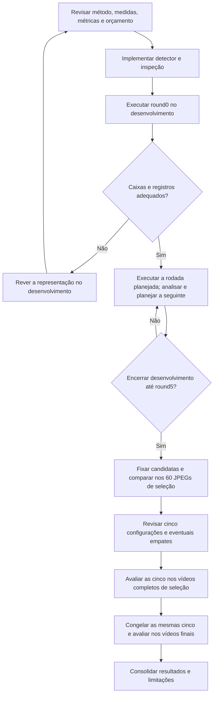

# Proposta de avaliação do detector de blobs

20/09/2026 — proposta técnica para revisão, antes da implementação.

O próximo experimento compara uma nova forma de detectar objetos com a
[limiarização concluída](conclusao_limiarizacao.md). Este documento propõe
o método, a representação das saídas e o ciclo experimental. Não contém
um batch executável nem valores de parâmetros já calibrados.

## 1. Método proposto e objetivo

Adotar **SimpleBlobDetector do OpenCV**, inicialmente sobre a imagem em cinza,
sem suavização, equalização ou morfologia adicional. Isso permite estudar
o efeito do detector antes de acrescentar novas etapas de processamento.
Blobs são regiões com características visuais semelhantes; não constituem,
por definição, espermatozoides nem aglomerados biológicos.

O método examina vários limiares e agrupa candidatos próximos, com filtros
configuráveis de cor, área e forma. Ele pertence à família clássica e mantém
relação com a limiarização. Sua principal diferença experimental será a
detecção em vários limiares e a filtragem dos candidatos. A saída usual são
pontos com posição e tamanho estimados. [Referência do OpenCV](https://docs.opencv.org/4.13.0/d0/d7a/classcv_1_1SimpleBlobDetector.html).

O objetivo é medir se essa combinação localiza melhor os indivíduos, mantendo
as três classes da base. Não se presume melhoria antes dos testes. k-NN fica
para o método híbrido; Watershed, rastreamento e previsão de movimento estão
fora deste primeiro experimento com blobs.

## 2. Decisão principal: como representar cada objeto

**Recomendação para a primeira versão: caixa calculada a partir do centro e
do diâmetro estimados pelo detector, com a origem dessas medidas explícita.**

Para centro `(cx, cy)`, diâmetro `d` e raio `r = d/2`, calcular:

```text
x0 = limitar(floor(cx - r), 0, largura_imagem)
y0 = limitar(floor(cy - r), 0, altura_imagem)
x1 = limitar(ceil(cx + r), 0, largura_imagem)
y1 = limitar(ceil(cy + r), 0, altura_imagem)
caixa = (x0, y0, x1 - x0, y1 - y0)
area_estimada_blob_px2 = pi * (d/2)^2
```

`limitar` restringe o valor ao intervalo informado. A caixa usa limites
direito e inferior exclusivos, como o contrato atual. Depois, é normalizada
no mesmo formato YOLO das anotações. Centro, diâmetro e coordenadas devem
ser finitos; diâmetro e dimensões da caixa precisam ser positivos. Dados
inválidos devem produzir erro explícito, não uma detecção artificial.

Antes do recorte na borda, a caixa envolve um círculo estimado, sem garantia
de conter a região real do objeto; pode cobrir mal objetos alongados ou irregulares. O IoU continuará
medindo a adequação dessa caixa às anotações.
Não haverá aumento artificial das caixas para melhorar o resultado nem
consulta às anotações dentro do detector. A revisão inicial deve verificar
se essa representação é adequada antes de comprometer todas as rodadas.

### Medidas disponíveis e indisponíveis

| Campo | Proposta |
|---|---|
| Caixa em pixels e normalizada | Calculada pela regra acima |
| `centro_blob_x`, `centro_blob_y` | Posição estimada retornada pelo detector |
| `diametro_blob_px` | Tamanho retornado pelo detector |
| `area_estimada_blob_px2` | Área do círculo estimado, antes do recorte na borda |
| `origem_medidas` | Identifica centro/diâmetro estimados pelo SimpleBlobDetector |
| `area_caixa` | Largura × altura da caixa recortada |
| `caixa_recortada_na_borda` | Indica se a caixa calculada ultrapassou a imagem |
| `area_pixels`, centroide da região, ocupação e intensidade da região | Indisponíveis nesta versão; registrar ausência, nunca zero ou estimativa no lugar |
| Vídeo, quadro e tempo | Mesmas identificações usadas na limiarização |

O centro do blob não será chamado de centroide dos pixels. A área estimada
não será gravada como `area_pixels`. Objetos na borda podem ter área estimada
maior que a área da caixa recortada; são medidas distintas. O alongamento
da caixa aproximada também não representa a forma real do objeto.

O contrato atual exige medidas de uma região binária. Será necessária uma
extensão explícita para medidas estimadas, preservando o tipo, o significado
e as validações das medidas da limiarização. Ausências serão aceitas somente
na modalidade estimada. A exportação deverá identificar os campos
indisponíveis, sem alterar os resultados antigos. O avaliador usa caixas e
classes e poderá manter a mesma regra de correspondência.

### Alternativa considerada: caixas de contornos

Obter uma região segmentada permitiria medir área e centroide dos pixels,
mas exigiria definir contorno, buracos e associação com cada detecção.
Preencher um contorno não recupera necessariamente a máscara original.

A API oferece coleta de contornos. Entretanto, na fonte consultada do
OpenCV 4.13.0, os contornos são acumulados antes do filtro final de repetição,
enquanto os pontos são emitidos após esse filtro. Assim, não se deve assumir
uma correspondência por índice entre as duas listas. Essa observação é de
leitura do código, ainda sem teste local. [Implementação de referência](https://github.com/opencv/opencv/blob/4.13.0/modules/features2d/src/blobdetector.cpp#L414-L435).

Por isso, a proposta inicial usa explicitamente a aproximação geométrica.
Uma variante com segmentação e contornos seria um desenho separado, a discutir
se a inspeção inicial indicar que as caixas aproximadas são inadequadas.
Não haverá troca silenciosa de representação entre versões da biblioteca.

## 3. Classes e parâmetros

Preservar 0 normal, 1 aglomerado e 2 pequeno. A hipótese inicial de classificação
será por **área estimada do blob**, com limites próprios: pequeno até um limite
superior, aglomerado a partir de um limite inferior e normal no intervalo.
Os limites não serão copiados da área segmentada da limiarização. Uma área
grande não comprova aglomeração, assim como uma pequena não comprova classe 2.

Essa regra precisa aceitar área real positiva e ter o campo de medida
explicitamente indicado. O classificador atual exige área inteira em pixels;
não deve receber valores arredondados para simular essa mesma medida.

| Grupo de parâmetros | O que será investigado | Risco a observar |
|---|---|---|
| Limiar inicial, final e passo | Faixa e resolução da exploração de intensidades | Custo maior ou perda de objetos pouco contrastados |
| Cor clara/escura | Qual aparência gera candidatos úteis | Detectar halos, fundo ou resíduos |
| Área mínima e máxima do filtro interno | Rejeição de regiões candidatas | Excluir pequenos ou aglomerados antes de classificá-los |
| Repetição mínima | Persistência dos candidatos entre limiares | Rejeitar objetos instáveis ou aceitar ruído |
| Distância entre blobs | Agrupamento de candidatos próximos | Fundir vizinhos ou preservar duplicações |
| Circularidade, inércia e convexidade | Filtros de forma, avaliados com controles sem esses filtros | Excluir cabeças alongadas ou regiões irregulares |
| Dois limites da classificação | Separação das classes pela área estimada | Classificar ruído como pequeno e objetos isolados como aglomerado |

No OpenCV, o máximo de área do filtro é exclusivo; o mínimo é inclusivo.
A área geométrica do contorno usada internamente, a área estimada do círculo
e a área da caixa são três medidas diferentes. Os limites do filtro interno
não são os limites do classificador final. Todos os valores e
filtros habilitados devem constar do plano, sem depender dos padrões implícitos
da biblioteca. [Parâmetros e filtros](https://docs.opencv.org/4.13.0/d0/d7a/classcv_1_1SimpleBlobDetector.html).

Validar previamente combinações incompatíveis, inclusive a faixa de limiares
e o requisito de repetição. `limiar_utilizado` será ausente (`null`) por não
existir um único limiar para toda a detecção; a faixa completa ficará no JSON.
Não será criado um valor de confiança probabilística sem um modelo calibrado.

## 4. Protocolo proposto

Reutilizar as imagens originais e a divisão já documentada:

| Etapa | Dados | Procedimento |
|---|---|---|
| Desenvolvimento | 178 JPEGs dos vídeos 11, 12, 15, 19, 21, 22, 23, 30, 35, 36, 47 e 60 | Mesmos quadros 0, 100, …, 1400, excluindo 900 e 1100 do vídeo 23 |
| Seleção em imagens | 60 JPEGs dos vídeos 13, 29, 52 e 54 | Comparar todas as configurações distintas fixadas ao terminar o desenvolvimento |
| Vídeos de seleção | MP4 completos 13, 29, 52 e 54 | Avaliar as cinco configurações escolhidas: 5.850 quadros por configuração |
| Vídeos finais | MP4 completos 14, 24, 38 e 82 | Mesmas cinco configurações congeladas: 5.910 quadros por configuração |

O uso de JPEGs e MP4 preserva a origem empregada na limiarização. Não supõe
igualdade de pixels entre formatos. Manter a conferência de alinhamento e os
hashes dos quadros decodificados nas etapas em vídeo. Ausência de anotação
continua sendo diferente de anotação vazia.

Usar desde o início o **F1 de indivíduos**, com o
[avaliador atual](avaliacao_individuos.py): IoU ≥ 0,50; pareamento um para um
maximizando quantidade de pares e depois soma de IoU; 0/2 no mesmo grupo;
classe 1 separada; erros 0/2 registrados à parte. Somar TP, FP e FN antes de
calcular F1. Manter `sem casos` e empates exatos sem novo peso ou desempate.

Todo relatório deverá acompanhar o F1 com precisão, recall, cobertura de 0 e 2,
classificação condicional, F1 de aglomerados e resultados por vídeo. Não se
propõe um piso de recall nem uma métrica ponderada nesta versão. Qualquer
mudança desse tipo exigirá uma revisão prévia do protocolo e da comparação.

### Rodadas, esforço e parada

1. **Round0:** inspeção de imagens de desenvolvimento que representem as três
   classes, vizinhança de objetos e bordas. Fixar a lista e os parâmetros da
   inspeção antes de executar. Conferir representação, unidades e arquivos.
2. **Round1:** exploração ampla, com plano salvo, alternativas claras/escuras
   e controles sem filtros de forma. As faixas numéricas serão propostas a
   partir do desenvolvimento e da inspeção; ainda não foram escolhidas.
3. **Rounds2–5:** refinar hipóteses justificadas pelos resultados anteriores,
   preservando controles e alguma exploração. As combinações completas serão
   registradas antes de cada execução. Não há garantia de melhoria por rodada.
4. **Encerramento:** no máximo cinco rodadas. Uma parada anterior poderá ser
   acordada após revisão, com justificativa registrada. Não haverá novas
   rodadas orientadas pelos vídeos finais.
5. **Seleção e vídeos:** remover configurações repetidas, congelar candidatas,
   comparar em outras imagens, revisar as cinco melhores e seguir aos vídeos.
   Empate atravessando a quinta vaga exige decisão registrada, sem escolha
   automática pelo ID ou pelo arredondamento.

Como referência de esforço, propor **até 136 execuções de configuração nos
178 quadros, incluindo controles repetidos, e até 122 configurações distintas**.
Esses números reproduzem o orçamento formal das cinco rodadas de limiarização;
o round0 fica separado. A distribuição entre rodadas ainda precisa ser definida.
Listas de classificação testadas separadamente também contam como tentativas
e devem ser registradas, inclusive se reaproveitarem detecções salvas.

Esse teto facilita a comparação, mas não iguala tempo computacional nem todo
o esforço histórico: a limiarização teve análises auxiliares de classificação
e mudou o critério de avaliação durante o estudo. Documentar essas diferenças;
não apresentar as buscas como idênticas. A seed proposta é 42 para eventual
sorteio de parâmetros; a lista completa salva é a referência da repetição.



## 5. Implementação posterior e reprodução

Após revisar a proposta, preparar `algoritmos/classicos/blobs.py` e uma
inspeção própria em `scripts/blobs/`. O detector receberá apenas imagem e
configuração, sem ler anotações, modificar a entrada ou gravar arquivos.

Reutilizar avaliação, leitura da base, exportação e composição visual onde
forem compatíveis. Os executores e relatórios atuais presumem limiarização
em nomes, configurações e métricas históricas; não basta trocar a importação
do detector. Adaptar interfaces explicitamente e preservar os comandos antigos.

Saídas propostas, seguindo a organização já usada:

```text
resultados/frame-to-frame/blobs/round<N>/
  batch__<execucao>/                 plano, resumos, código e PDF
  <configuracao>__<execucao>/         parâmetros, imagens e tabelas
resultados/frame-to-frame/blobs/selecao/
  batch__<execucao>/
  <configuracao>__<execucao>/
resultados/videos/blobs/<selecao-ou-final>/batch__<execucao>/
  <configuracao>__<execucao>/         parâmetros, tabelas e vídeos
```

O nome legível terá um identificador derivado de todos os parâmetros. Cada
execução registrará entradas, hashes, parâmetros, versões, código e situação.
Não depender somente da seed nem de um commit com alterações locais.
Preservar saídas anteriores, falhas parciais e registros de imagens sem objetos.

Para evitar a dependência de caminhos históricos rígidos observada na
limiarização, os futuros executores deverão aceitar explicitamente o batch
de origem, conferir seu conteúdo e registrar seus hashes. Não escolher a
execução mais recente automaticamente. Essa melhoria não modifica agora
os scripts ou os planos congelados da limiarização.

O ambiente da limiarização registrou `opencv-python 4.13.0.92`. Usá-lo como
referência inicial para compatibilidade; a versão efetivamente usada no blob
deverá ser fixada e registrada. Não houve instalação ou teste dessa API nesta
preparação. Os testes futuros devem cobrir geometria, bordas, medidas ausentes,
configurações inválidas, igualdade da entrada antes/depois e compatibilidade
dos resultados antigos. A execução dos testes e experimentos caberá ao pesquisador.

## 6. Limitações a preservar na interpretação

- **Pequenos e ruído:** filtros mais permissivos podem elevar simultaneamente
  cobertura e falsas detecções. A revisão deve observar ambos, sem presumir
  que mais caixas significam melhor desempenho.
- **Vizinhos e aglomerados:** agrupamento espacial pode juntar indivíduos;
  filtros de forma podem eliminar aglomerados. A classificação por área é
  uma hipótese limitada, não a identificação biológica do objeto.
- **Caixa aproximada:** uma boa posição central pode coexistir com IoU baixo.
  Isso é uma limitação da proposta de saída; não justifica relaxar o avaliador
  apenas para favorecer o novo método.
- **Temporalidade:** contagens nos vídeos são ocorrências por quadro. Centro
  estimado e tempo podem apoiar rastreamento futuro, mas não fornecem agora
  identidade, velocidade, trajetória ou medidas em micrômetros.
- **Exposição aos dados:** os resultados finais da limiarização já foram
  examinados e motivaram preocupações sobre o próximo método. Reutilizar os
  mesmos vídeos permite comparação, mas não representa teste inteiramente
  inédito. Ajustar somente no desenvolvimento reduz novo uso indevido do
  conjunto final; não apaga o conhecimento anterior. Uma futura confirmação
  independente exigirá dados ainda não usados para orientar decisões.

## 7. Pontos para aprovação

1. SimpleBlobDetector em cinza, sem processamento adicional inicial.
2. Caixas por centro/diâmetro e medidas explicitamente estimadas; revisão da
   adequação no round0 antes dos batches.
3. Classificação inicial por área estimada, com limites próprios e três classes.
4. Mesmo ciclo e dados, F1 de indivíduos desde o início e diagnóstico por classe.
5. Até cinco rodadas, teto proposto de tentativas e seed 42 quando houver sorteio.

A implementação do detector e do round0 é a próxima etapa proposta. O plano
numérico do round1 será uma entrega posterior à inspeção inicial, antes de
qualquer execução em batch. Nenhum detector, batch ou teste foi executado
para preparar este documento.
