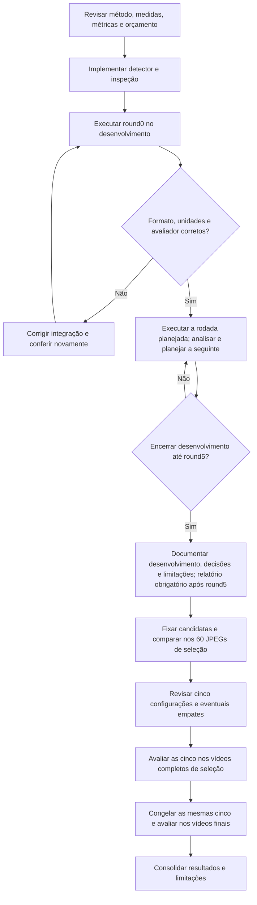

# Plano de avaliação do detector de blobs

20/09/2026 — round0 e diagnóstico concluídos; round1 concluído e analisado.
Round2, round3 e [round4 concluídos e analisados](analise_round4_blobs.md).
[Round5 concluído e analisado](analise_round5_blobs.md): 14 configurações,
quatro controles e dez novas; 119 distintas avaliadas. O
[documento completo](desenvolvimento_blobs.html) sintetiza as cinco rodadas.

A [síntese de continuidade](estado_pesquisa.md) registra o estado atual e a
decisão de incorporar os ajustes às rodadas formais. Foram aprovadas caixas
original/escala/margem e até cinco rodadas de 48/32/24/18/14 configurações,
com teto de 122 distintas. Não há exigência de bom F1 antes do round1 nem
incompatibilidade de formato impedindo sua preparação.

O próximo experimento compara uma nova forma de detectar objetos com a
[limiarização concluída](conclusao_limiarizacao.md). Este documento registra
o método, a representação das saídas e o ciclo experimental. Detector,
inspeção, adaptação de caixas e executor de rodadas estão disponíveis no
[guia de blobs](../scripts/blobs/README.md). O
[plano congelado do round1](../scripts/blobs/rodadas/round1.json) contém
48 configurações distintas, sendo 12 controles e 36 exploratórias, geradas
com seed 42 para os 178 quadros. A primeira tentativa foi interrompida e a
repetição concluída; desempenho de desenvolvimento não constitui validação final.

O [diagnóstico do round0](diagnostico_round0_blobs.md) confirmou caixas
subdimensionadas apesar de conversão coerente, além de candidatos excedentes.
O [plano de diagnóstico e próximos testes](plano_diagnostico_blobs.md)
registra os resultados, a revisão dessa hipótese e a sequência de trabalho.

## 1. Método proposto e objetivo

A descrição abaixo registra a versão inicial. A extensão aprovada no
[round2](plano_round2_blobs.md) acrescenta CLAHE como pré-processamento
controlado e LoG/DoG como detectores identificados, com o mesmo formato de
saída e avaliador. O round1 permanece preservado; o orçamento não aumenta.

Adotar **SimpleBlobDetector do OpenCV**, inicialmente sobre a imagem em cinza,
sem suavização, equalização ou morfologia adicional. Isso permite estudar
o efeito do detector antes de acrescentar novas etapas de processamento.
Blobs são regiões com características visuais semelhantes; não constituem,
por definição, espermatozoides nem aglomerados biológicos.

O método examina vários limiares e agrupa candidatos próximos, com filtros
configuráveis de cor, área e forma. Ele pertence à família clássica e mantém
relação com a limiarização. Sua principal diferença experimental será a
detecção em vários limiares e a filtragem dos candidatos. A saída usual são
pontos com posição e tamanho estimados. [Referência do OpenCV](https://docs.opencv.org/4.13.0/d0/d7a/classcv_1_1SimpleBlobDetector.html).

O objetivo é medir se essa combinação localiza melhor os indivíduos, mantendo
as três classes da base. Não se presume melhoria antes dos testes. k-NN fica
para o método híbrido; Watershed, rastreamento e previsão de movimento estão
fora deste primeiro experimento com blobs.

## 2. Decisão principal: como representar cada objeto

**Recomendação para a primeira versão: caixa calculada a partir do centro e
do diâmetro estimados pelo detector, com a origem dessas medidas explícita.**

Para centro `(cx, cy)`, diâmetro `d` e raio `r = d/2`, calcular:

```text
x0 = limitar(floor(cx - r), 0, largura_imagem)
y0 = limitar(floor(cy - r), 0, altura_imagem)
x1 = limitar(ceil(cx + r), 0, largura_imagem)
y1 = limitar(ceil(cy + r), 0, altura_imagem)
caixa = (x0, y0, x1 - x0, y1 - y0)
area_estimada_blob_px2 = pi * (d/2)^2
```

`limitar` restringe o valor ao intervalo informado. A caixa usa limites
direito e inferior exclusivos, como o contrato atual. Depois, é normalizada
no mesmo formato YOLO das anotações. Centro, diâmetro e coordenadas devem
ser finitos; diâmetro e dimensões da caixa precisam ser positivos. Dados
inválidos devem produzir erro explícito, não uma detecção artificial.

Antes do recorte na borda, a caixa envolve um círculo estimado, sem garantia
de conter a região real do objeto; pode cobrir mal objetos alongados ou irregulares. O IoU continuará
medindo a adequação dessa caixa às anotações.
Esta é a conversão original, preservada como referência. Escala e margem
estão implementadas no [adaptador separado](../algoritmos/classicos/caixas_blobs.py):
o lado passa a ser `fator × diâmetro` ou `diâmetro + 2 × margem`, antes do
mesmo arredondamento e recorte. A adaptação parte das medidas brutas,
preservando centro, diâmetro, área circular, classe e ordem dos candidatos.
Não combina as duas regras, consulta anotações ou altera o avaliador.
O round1 registra tanto a caixa original quanto a usada na avaliação.
Segmentação local permanece fora desta implementação.

### Medidas disponíveis e indisponíveis

| Campo exportado | Significado |
|---|---|
| Caixa em pixels e normalizada | Regra original ou variante explícita de escala/margem do plano |
| `centro_blob_x_px`, `centro_blob_y_px` | Posição estimada retornada pelo detector |
| `diametro_blob_px` | Tamanho retornado pelo detector |
| `area_estimada_blob_px2` | Área do círculo estimado, antes do recorte na borda |
| `origem_medidas` | Identifica centro/diâmetro estimados pelo SimpleBlobDetector |
| `area_caixa_px2` | Largura × altura da caixa recortada |
| `caixa_recortada_na_borda` | Indica se a caixa calculada ultrapassou a imagem |
| `area_pixels`, centroide da região, ocupação e intensidade da região | Indisponíveis nesta versão; registrar ausência, nunca zero ou estimativa no lugar |
| Vídeo, quadro e tempo | Mesmas identificações usadas na limiarização |

O centro do blob não será chamado de centroide dos pixels. A área estimada
não será gravada como `area_pixels`. Objetos na borda podem ter área estimada
maior que a área da caixa recortada; são medidas distintas. O alongamento
da caixa aproximada também não representa a forma real do objeto.

O contrato foi estendido com o tipo `MedidasBlob`, preservando o tipo,
o significado e as validações das medidas segmentadas em `MedidasObjeto`.
Ausências são aceitas somente na modalidade estimada. Os registros antigos
da limiarização conservam seus campos; blobs acrescenta os campos de
estimativa e deixa vazias as medidas que exigiriam segmentação.
O avaliador usa caixas e classes, mantendo a mesma correspondência.

### Alternativa considerada: caixas de contornos

Obter uma região segmentada permitiria medir área e centroide dos pixels,
mas exigiria definir contorno, buracos e associação com cada detecção.
Preencher um contorno não recupera necessariamente a máscara original.

A API oferece coleta de contornos. Entretanto, na fonte consultada do
OpenCV 4.13.0, os contornos são acumulados antes do filtro final de repetição,
enquanto os pontos são emitidos após esse filtro. Assim, não se deve assumir
uma correspondência por índice entre as duas listas. Essa observação é de
leitura do código, ainda sem teste local. [Implementação de referência](https://github.com/opencv/opencv/blob/4.13.0/modules/features2d/src/blobdetector.cpp#L414-L435).

Por isso, a proposta inicial usa explicitamente a aproximação geométrica.
Uma variante com segmentação e contornos seria um desenho separado, a discutir
se a inspeção inicial indicar que as caixas aproximadas são inadequadas.
Não haverá troca silenciosa de representação entre versões da biblioteca.

## 3. Classes e parâmetros

Preservar 0 normal, 1 aglomerado e 2 pequeno. A hipótese inicial de classificação
será por **área estimada do blob**, com limites próprios: pequeno até um limite
superior, aglomerado a partir de um limite inferior e normal no intervalo.
Os limites não serão copiados da área segmentada da limiarização. Uma área
grande não comprova aglomeração, assim como uma pequena não comprova classe 2.

Essa regra aceita área real positiva em `ConfiguracaoAreaEstimada`. O
classificador original da limiarização, `ConfiguracaoArea`, continua exigindo
área inteira em pixels; não recebe valores arredondados para simular essa
mesma medida.

| Grupo de parâmetros | O que será investigado | Risco a observar |
|---|---|---|
| Limiar inicial, final e passo | Faixa e resolução da exploração de intensidades | Custo maior ou perda de objetos pouco contrastados |
| Cor clara/escura | Qual aparência gera candidatos úteis | Detectar halos, fundo ou resíduos |
| Área mínima e máxima do filtro interno | Rejeição de regiões candidatas | Excluir pequenos ou aglomerados antes de classificá-los |
| Repetição mínima | Persistência dos candidatos entre limiares | Rejeitar objetos instáveis ou aceitar ruído |
| Distância entre blobs | Agrupamento de candidatos próximos | Fundir vizinhos ou preservar duplicações |
| Circularidade, inércia e convexidade | Filtros de forma, avaliados com controles sem esses filtros | Excluir cabeças alongadas ou regiões irregulares |
| Dois limites da classificação | Separação das classes pela área estimada | Classificar ruído como pequeno e objetos isolados como aglomerado |

No OpenCV, o máximo de área do filtro é exclusivo; o mínimo é inclusivo.
A área geométrica do contorno usada internamente, a área estimada do círculo
e a área da caixa são três medidas diferentes. Os limites do filtro interno
não são os limites do classificador final. Todos os valores e
filtros habilitados devem constar do plano, sem depender dos padrões implícitos
da biblioteca. [Parâmetros e filtros](https://docs.opencv.org/4.13.0/d0/d7a/classcv_1_1SimpleBlobDetector.html).

O módulo valida combinações incompatíveis, inclusive a faixa de limiares
e o requisito de repetição. Nesta versão, o passo precisa ser pelo menos 1
na escala uint8, evitando passagens subunitárias e uma exploração excessiva
de limiares equivalentes. São exigidos pelo menos dois limiares e valores
válidos após a conversão dos parâmetros float32 do OpenCV.
`limiar_utilizado` é ausente (`null`) por não
existir um único limiar para toda a detecção; a faixa completa ficará no JSON.
Não será criado um valor de confiança probabilística sem um modelo calibrado.

## 4. Protocolo e orçamento acordados

Reutilizar as imagens originais e a divisão já documentada:

| Etapa | Dados | Procedimento |
|---|---|---|
| Desenvolvimento | 178 JPEGs dos vídeos 11, 12, 15, 19, 21, 22, 23, 30, 35, 36, 47 e 60 | Mesmos quadros 0, 100, …, 1400, excluindo 900 e 1100 do vídeo 23 |
| Seleção em imagens | 60 JPEGs dos vídeos 13, 29, 52 e 54 | Comparar todas as configurações distintas fixadas ao terminar o desenvolvimento |
| Vídeos de seleção | MP4 completos 13, 29, 52 e 54 | Avaliar as cinco configurações escolhidas: 5.850 quadros por configuração |
| Vídeos finais | MP4 completos 14, 24, 38 e 82 | Mesmas cinco configurações congeladas: 5.910 quadros por configuração |

O uso de JPEGs e MP4 preserva a origem empregada na limiarização. Não supõe
igualdade de pixels entre formatos. Manter a conferência de alinhamento e os
hashes dos quadros decodificados nas etapas em vídeo. Ausência de anotação
continua sendo diferente de anotação vazia.

Usar desde o início o **F1 de indivíduos**, com o
[avaliador atual](avaliacao_individuos.py): IoU ≥ 0,50; pareamento um para um
maximizando quantidade de pares e depois soma de IoU; 0/2 no mesmo grupo;
classe 1 separada; erros 0/2 registrados à parte. Somar TP, FP e FN antes de
calcular F1. Manter `sem casos` e empates exatos sem novo peso ou desempate.

Todo relatório deverá acompanhar o F1 com precisão, recall, cobertura de 0 e 2,
classificação condicional, F1 de aglomerados e resultados por vídeo. Não se
propõe um piso de recall nem uma métrica ponderada nesta versão. Qualquer
mudança desse tipo exigirá uma revisão prévia do protocolo e da comparação.

### Rodadas, esforço e parada

1. **Round0:** inspeção de imagens de desenvolvimento que representem as três
   classes, vizinhança de objetos e bordas. Fixar a lista e os parâmetros da
   inspeção antes de executar. Conferir representação, unidades e arquivos.
2. **Round1:** exploração ampla preparada, com plano salvo, alternativas
   claras/escuras e controles sem filtros de forma. São 12 comparações
   controladas de caixa e 36 combinações exploratórias, todas distintas.
   Faixas e justificativas estão no [desenho do round1](plano_round1_blobs.md);
   nenhuma das 8.544 avaliações previstas foi executada.
3. **Rounds2–5:** refinar hipóteses justificadas pelos resultados anteriores,
   preservando controles e alguma exploração. As combinações completas serão
   registradas antes de cada execução. Não há garantia de melhoria por rodada.
4. **Encerramento:** no máximo cinco rodadas. Uma parada anterior poderá ser
   acordada após revisão, com justificativa registrada. Não haverá novas
   rodadas orientadas pelos vídeos finais.
5. **Relatório após o round5:** ao concluir e analisar as cinco rodadas,
   documentar o desenvolvimento de blobs antes da seleção. Explicar o método,
   adaptações das caixas, dados e critérios de comparação, configurações,
   hipóteses e resultados de cada rodada, motivos dos refinamentos,
   reprodução e limitações. Distinguir escolhas anteriores aos testes das
   mudanças motivadas pelos resultados. Essa entrega foi solicitada pelo
   pesquisador e não substitui a avaliação posterior em seleção e vídeos.
6. **Seleção e vídeos:** remover configurações repetidas, congelar candidatas,
   comparar em outras imagens, revisar as cinco melhores e seguir aos vídeos.
   Empate atravessando a quinta vaga exige decisão registrada, sem escolha
   automática pelo ID ou pelo arredondamento.

Foi aprovado o limite de **até 136 execuções de configuração nos
178 quadros, incluindo controles repetidos, e até 122 configurações distintas**.
Esses números reproduzem o orçamento formal das cinco rodadas de limiarização;
o round0 fica separado. A distribuição aprovada é **48/32/24/18/14**.
Cada combinação de detector, caixa e classificação conta nesse limite.
Listas de classificação testadas separadamente também contam como tentativas
e devem ser registradas, inclusive se reaproveitarem detecções salvas.

Esse teto facilita a comparação, mas não iguala tempo computacional nem todo
o esforço histórico: a limiarização teve análises auxiliares de classificação
e mudou o critério de avaliação durante o estudo. Documentar essas diferenças;
não apresentar as buscas como idênticas. A geração do round1 usa seed 42;
a lista completa salva é a referência da repetição. O executor não sorteia
configurações durante o experimento.



## 5. Implementação e reprodução

O detector está em [blobs.py](../algoritmos/classicos/blobs.py) e a inspeção
tem um único ponto de entrada:
[executar_inspecao.py](../scripts/blobs/executar_inspecao.py).
O detector recebe apenas imagem e configuração, sem ler anotações,
modificar a entrada ou gravar arquivos.

A nova regra de caixa permanece separada do parser do detector. As rodadas
usam [executar_rodada.py](../scripts/blobs/executar_rodada.py), o
[planejamento próprio](../scripts/blobs/planejamento.py) e o
[relatório de rodadas](relatorio_rodada_blobs.py). Reutilizam leitura,
exportação, composição visual e o avaliador atual de indivíduos. Os
executores, planos e resultados anteriores foram preservados.

Saídas das rodadas implementadas e organização prevista para seleção/vídeos:

```text
resultados/frame-to-frame/blobs/round<N>/
  batch__<execucao>/                 plano, resumos, código e PDF
  <configuracao>__<execucao>/         parâmetros, imagens e tabelas
resultados/frame-to-frame/blobs/selecao/
  batch__<execucao>/
  <configuracao>__<execucao>/
resultados/videos/blobs/<selecao-ou-final>/batch__<execucao>/
  <configuracao>__<execucao>/         parâmetros, tabelas e vídeos
```

O nome curto das configurações tem um hash derivado de todos os parâmetros
efetivos, classificação e regra de caixa. Cada execução registra entradas,
hashes, parâmetros, versões, código e situação.
Não depender somente da seed nem de um commit com alterações locais.
Preservar saídas anteriores, falhas parciais e registros de imagens sem objetos.

Para evitar a dependência de caminhos históricos rígidos observada na
limiarização, os futuros executores deverão aceitar explicitamente o batch
de origem, conferir seu conteúdo e registrar seus hashes. Não escolher a
execução mais recente automaticamente. Essa melhoria não modifica agora
os scripts ou os planos congelados da limiarização.

O ambiente da limiarização registrou `opencv-python 4.13.0.92`. Essa versão
foi fixada em [requirements-blobs.txt](../algoritmos/classicos/requirements-blobs.txt)
como referência inicial. O executor registra as versões importadas e os
parâmetros efetivos do OpenCV, além da configuração originalmente informada.

A implementação do round1 passou em **179 testes sintéticos: 66 novos e
113 de regressão**. Foram revisadas oito páginas do PDF sintético. A
conferência real `--conferir` passou para 48 configurações e 178 quadros,
sem detecção nem criação de resultados. Ela verifica dependências, planos,
hashes e decodificação das imagens antes da execução. Essas conferências não
constituem medição de desempenho do detector na base.

Na raiz do projeto:

```powershell
& "C:\Python313\python.exe" ".\scripts\blobs\executar_rodada.py" --rodada round1 --conferir
& "C:\Python313\python.exe" ".\scripts\blobs\executar_rodada.py" --rodada round1
```

O segundo comando executa as 8.544 avaliações e fica a cargo do pesquisador.
Também há `--plano` para indicar a lista salva e `--somente-relatorio` para
gerar nova versão do PDF a partir de um batch concluído. Os cinco planos
de desenvolvimento foram executados e analisados. Os executores
de seleção e vídeos de blobs dependem das próximas etapas.

## 6. Limitações a preservar na interpretação

- **Pequenos e ruído:** filtros mais permissivos podem elevar simultaneamente
  cobertura e falsas detecções. A revisão deve observar ambos, sem presumir
  que mais caixas significam melhor desempenho.
- **Vizinhos e aglomerados:** agrupamento espacial pode juntar indivíduos;
  filtros de forma podem eliminar aglomerados. A classificação por área é
  uma hipótese limitada, não a identificação biológica do objeto.
- **Caixa aproximada:** uma boa posição central pode coexistir com IoU baixo.
  Isso é uma limitação da proposta de saída; não justifica relaxar o avaliador
  apenas para favorecer o novo método.
- **Temporalidade:** contagens nos vídeos são ocorrências por quadro. Centro
  estimado e tempo podem apoiar rastreamento futuro, mas não fornecem agora
  identidade, velocidade, trajetória ou medidas em micrômetros.
- **Exposição aos dados:** os resultados finais da limiarização já foram
  examinados e motivaram preocupações sobre o próximo método. Reutilizar os
  mesmos vídeos permite comparação, mas não representa teste inteiramente
  inédito. Ajustar somente no desenvolvimento reduz novo uso indevido do
  conjunto final; não apaga o conhecimento anterior. Uma futura confirmação
  independente exigirá dados ainda não usados para orientar decisões.

## 7. Diretrizes da primeira implementação

1. SimpleBlobDetector em cinza, sem processamento adicional inicial.
2. Caixas por centro/diâmetro e medidas explicitamente estimadas; revisão da
   adequação no round0 antes dos batches.
3. Classificação inicial por área estimada, com limites próprios e três classes.
4. Mesmo ciclo e dados, F1 de indivíduos desde o início e diagnóstico por classe.
5. Até cinco rodadas, teto aprovado de 136 execuções e 122 distintas;
   distribuição 48/32/24/18/14. Round1 gerado com seed 42.

O plano numérico do round1 está preparado após o diagnóstico da inspeção
inicial. O pesquisador executou o round0, com 12 avaliações concluídas;
os resultados não demonstraram eficácia satisfatória. Nenhuma rodada ampla
de blobs foi executada, e não há cinco finalistas de blobs escolhidas.

## 8. Viabilidade estrutural e round0 concluído

Foi conferido o formato das caixas anotadas nos mesmos 178 JPEGs de
desenvolvimento. As dimensões foram lidas dos cabeçalhos JPEG; larguras e
alturas normalizadas foram convertidas em pixels antes de calcular a razão
entre o maior e o menor lado. Não houve execução do detector nessa conferência.

| Classe | Ocorrências anotadas | Mediana da razão dos lados | Caixas com razão maior que 2,25 |
|---|---:|---:|---:|
| 0 — normal | 3.464 | 1,0833 | 18 |
| 1 — aglomerado | 109 | 1,1282 | 0 |
| 2 — pequeno | 134 | 1,1250 | 0 |

No caso geométrico ideal, uma caixa quadrada centrada num retângulo de razão
`r ≥ 1` alcança no máximo `IoU = 1 / (2 × sqrt(r) - 1)`, otimizando seu tamanho.
Esse máximo é menor que 0,50 quando `r > 2,25`. A conta ignora arredondamento
para pixels e recorte nas bordas, que podem alterar o formato exportado.
Ela serve como diagnóstico da representação, não como novo filtro ou métrica
de seleção. Nenhuma anotação foi excluída.

A maioria das caixas anotadas tem formato próximo do quadrado, inclusive
nas classes 1 e 2. Portanto, sua geometria não impede tentar a representação
proposta. Isso não comprova que o blob estime o centro e o diâmetro corretos
nem que a região biológica seja circular. O diagnóstico do round0 mostrou
limitações de extensão das caixas e candidatos excedentes.

O [plano de inspeção](../scripts/blobs/inspecao/round0.json) fixa seis imagens
de desenvolvimento e duas configurações, clara e escura: **12 avaliações**.
Usa os quadros 11/0, 12/200, 19/0, 21/0, 23/0 e 36/1300, com hashes
conferidos contra o plano do desenvolvimento. Eles incluem as três classes,
poucos e muitos objetos e anotações próximas das bordas.

Os parâmetros exploram limiares 10 a 240 em passos de 10, repetição mínima 2,
distância 3 pixels, área interna de 3 inclusive a 5.000 exclusive e filtros
de forma desligados. A classificação usa diâmetros hipotéticos de 8 e 24
pixels, convertidos em área estimada. São valores de sondagem, sem calibração
ou alegação biológica. Motivos e comandos estão no guia de blobs.

O round0 foi executado e diagnosticado. A saída é compatível com o avaliador;
candidatos e delimitação são os principais eixos de investigação do round1
nos 178 quadros. O executor e o plano do round1 estão preparados. Seleção e
vídeos permanecem previstos, com os respectivos executores ainda a preparar.
Bom F1 não é requisito de integração.
