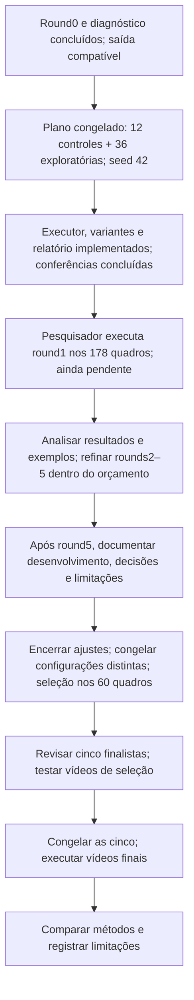

# Diagnóstico e próximos testes de blobs

20/09/2026 — round0 e diagnóstico concluídos; round1 concluído e analisado.
Round2 a definir (ver [análise do round1](analise_round1_blobs.md)).

**Revisão de escopo:** a [síntese de continuidade](estado_pesquisa.md) registra
a decisão de incorporar testes de candidatos, caixas e classificação às rodadas formais.
As seções abaixo descrevem hipóteses, não uma exigência de calibrar o detector
antes do round1. O formato e a exportação já são compatíveis com o avaliador.
F1 baixo não impede iniciar a busca. Foram aprovados original/escala/margem
e até cinco rodadas de 48/32/24/18/14 configurações, com teto de 122 distintas.
O executor e o [plano congelado do round1](../scripts/blobs/rodadas/round1.json)
estão preparados: 12 controles + 36 combinações exploratórias distintas,
seed 42 e 8.544 avaliações previstas nos mesmos 178 quadros. Os planos das
rodadas seguintes dependem dos resultados.

O [diagnóstico do round0](diagnostico_round0_blobs.md) registra os resultados:
caixas subdimensionadas apesar de conversão coerente, candidatos excedentes
e diferenças entre classes. O formato quadrado, isoladamente, não explica
a insuficiência observada. As adaptações de caixa foram implementadas e
verificadas com dados sintéticos e analisadas nas saídas da rodada completa.

## Objetivo e situação atual

Localizar indivíduos das classes 0 e 2, representar cada ocorrência por uma
caixa compatível com as anotações e avaliar aglomerados (classe 1) separadamente.
Uma troca entre 0 e 2 continua sendo acerto de localização e erro de
classificação. Rastreamento, identidade persistente e velocidade pertencem a
uma etapa posterior. Os registros atuais devem preservar posição, unidades,
origem e significado das medidas para permitir esse trabalho futuro.

A primeira inspeção foi executada pelo pesquisador:
`inspecao__20260920T041252237886Z`. Foram conferidos os 12 resultados, as
imagens, tabelas, arquivos de reprodução e a integridade do PDF. A inspeção
usa seis imagens de desenvolvimento, sem dados de seleção ou vídeos finais.

| Configuração | Detecções totais | Previsões de indivíduos | TP indivíduos | FP indivíduos | FN indivíduos | F1 indivíduos |
|---|---:|---:|---:|---:|---:|---:|
| b01 — claros | 619 | 604 | 2 | 602 | 165 | 0,005188 |
| b02 — escuros | 2.485 | 2.472 | 2 | 2.470 | 165 | 0,001516 |

Cada configuração foi avaliada sobre 160 normais, 7 pequenos e 5 aglomerados.
Nenhum pequeno ou aglomerado obteve correspondência válida. A classificação
correta dos dois pares normais, isoladamente, não indica um bom classificador.

As imagens sugerem caixas sobre regiões brilhantes menores que as cabeças
anotadas, além de candidatos excedentes. Uma detecção marcada como FP pode
estar sobre um objeto verdadeiro com caixa insuficiente: FP não equivale
automaticamente a ruído. Tampouco um centro dentro de uma anotação comprova
um acerto ou uma correspondência exclusiva.

Mesmo com todos os 167 indivíduos encontrados, conservar 604 previsões de
indivíduos deixaria pelo menos 437 FP. Sob essa hipótese de quantidade e
classes fixas, o teto de F1 seria `334 / 771 = 0,4332`. É um limite aritmético,
não um resultado de nova configuração. Portanto, o tamanho da caixa e o
excesso de candidatos precisam ser investigados separadamente.

## Regras preservadas

- Manter os arquivos originais, os resultados e o código arquivado do round0.
- As próximas execuções experimentais serão realizadas pelo pesquisador;
  o diagnóstico dos registros está concluído.
- Manter o avaliador atual: IoU mínimo de 0,50, grupos 0/2 e 1, correspondência
  um para um, classificação separada e agregação das contagens antes do F1.
- Não transformar os diagnósticos abaixo em critérios novos de ranking.
- Ajustar no desenvolvimento; congelar regras antes da seleção e dos vídeos.
- Registrar toda tentativa, inclusive variações de caixa e classificação que
  reutilizem candidatos salvos. Preservar controles e resultados desfavoráveis.
- Reutilizar os mesmos conjuntos, reconhecendo a exposição anterior aos dados
  documentada no [plano geral](plano_blobs.md).

## Sequência de trabalho



### Etapa A — diagnóstico dos registros existentes: concluída

Execução `diagnostico__20260920T175946938558Z`: 12/12 casos concluídos,
origem preservada e arquivos conferidos. Os 36 testes sintéticos específicos
do diagnóstico passaram. A [análise dos resultados](diagnostico_round0_blobs.md)
separa extensão das caixas, posição dos centros e multiplicidade.

O novo comando lê o round0 concluído e produz uma pasta de diagnóstico, sem
executar SimpleBlobDetector ou mudar caixas, classes ou métricas anteriores.
O caminho da inspeção de origem é obrigatório: não se escolhe automaticamente
a execução mais recente.

O diagnóstico examina:

1. Quantos centros originais de blobs ficam dentro de cada caixa anotada:
   zero, um ou vários. Usa o centro retornado pelo detector, não o centro da
   caixa recortada. Bordas direita e inferior são exclusivas.
2. Quantas anotações contêm cada centro: zero, uma ou várias. Anotações
   sobrepostas podem produzir ambiguidade; isso precisa permanecer visível.
3. A razão entre área da caixa prevista e área da caixa anotada em cada
   incidência. Esse valor descreve retângulos, não a área biológica da cabeça.
4. A maior IoU disponível para cada anotação, com qualquer classe e dentro
   do mesmo grupo. Trata-se de um diagnóstico sem exclusividade, não de um
   novo matching, recall ou F1.

Os registros mantêm índices, classes e coordenadas. Nenhuma incidência recebe
automaticamente o rótulo de acerto, duplicata, ruído ou fragmento. Uma caixa
anotada pode incluir fundo, uma cauda ou mais de um ponto brilhante; o centro
estar dentro dela é apenas uma relação geométrica.

Saídas em uma pasta nova `resultados/frame-to-frame/blobs/round0/diagnostico__<UTC>/`:

- JSON completo e arquivos por configuração/quadro;
- tabelas de resumo, anotações e detecções;
- modelo de ficha de revisão humana com campos de parecer inicialmente vazios;
- guia com links para as comparações já existentes;
- origem, hashes e código arquivado para reprodução.

Essa etapa não gera outro PDF ou outras imagens: o PDF e as comparações
originais continuam disponíveis. Não é uma rodada adicional de parâmetros.

### Etapa B — revisão visual pontual, quando necessária

Os exemplos já examinados permitem formular hipóteses para o round1. Revisar
casos adicionais apenas quando houver uma dúvida concreta; o preenchimento
integral da ficha não é requisito para iniciar a busca formal.

Revisar as duas configurações nos mesmos seis quadros. Começar por casos com
nenhum centro, vários centros, sobreposição de anotações e caixa pequena com
centro aparentemente plausível. Incluir também casos simples com um centro,
as sete ocorrências de pequenos e as cinco de aglomerados.

O modelo identifica tanto anotações quanto candidatos, inclusive aqueles
sem centro em nenhuma anotação. Filtrar casos representativos por tipo e
quantidade de relações; não é necessário preencher todos os candidatos
para iniciar a discussão das causas. Manter explícito o que foi revisado
e o que permanece sem parecer.

Copiar `modelo_revisao_humana.csv` para `revisao_humana_preenchida.csv` antes
de preencher. O modelo integra os hashes dos arquivos gerados; a cópia é um
registro manual posterior, fora desses hashes. Na cópia, registrar hipótese
e observação visual, sem alterar a base:

| Situação observada | Pergunta a responder | Possível consequência |
|---|---|---|
| Nenhum centro na cabeça | O objeto é pouco contrastado ou foi rejeitado? | Rever faixa de limiares e filtros; aumentar caixa de outro objeto não o recupera |
| Vários centros na cabeça | São fragmentos do mesmo objeto ou indivíduos próximos? | Investigar agrupamento e repetibilidade, sem fundir vizinhos automaticamente |
| Centro fora das anotações | Há resíduo, fundo, cauda ou possível objeto não anotado? | Registrar o caso; manter a referência oficial de avaliação |
| Centro plausível, caixa pequena | Foi detectado só brilho, parte da cabeça ou uma estrutura diferente? | Comparar formas de delimitar o objeto |
| Centro compartilhado por anotações | Há sobreposição entre aglomerado e indivíduo ou proximidade? | Manter ambiguidade explícita, sem reutilizar esse centro como vários acertos |

Entrega desta etapa: lista de causas observadas e exemplos localizáveis por
configuração, vídeo, quadro e índice. As seis imagens são uma amostra
intencional de inspeção; não estimam o desempenho geral do método.

### Etapa C — hipóteses de candidatos para as rodadas

Os valores do round1 estão definidos no [plano detalhado](plano_round1_blobs.md),
usando o diagnóstico concluído. As famílias abaixo orientam as hipóteses.
O primeiro plano contém comparações controladas de caixa e combinações amplas
do detector/classificação; novos controles de filtros poderão ser definidos
nas rodadas seguintes. b01/b02 permanecem como referências, sem escolher
uma polaridade apenas pelo F1 atual.

| Teste planejado | O que varia | O que observar |
|---|---|---|
| C0 — referência | Nenhum parâmetro | Reprodução e efeito do ambiente |
| C1 — intensidades | Faixa de limiares; depois, passo | Cabeças com pouco contraste, brilho e respostas do fundo |
| C2 — persistência | Repetibilidade mínima | Candidatos instáveis versus pequenos reais perdidos |
| C3 — tamanho do candidato | Área mínima/máxima interna | Redução de resíduos sem excluir cabeças pequenas |
| C4 — forma | Circularidade, inércia e convexidade, separadamente | Utilidade e rejeições indevidas de cabeças alongadas/aglomerados |
| C5 — proximidade | Distância de agrupamento | Fragmentação e fusão de indivíduos vizinhos |

A área interna do filtro é área de contorno; não copiar limites obtidos para
pixels segmentados ou para o círculo estimado. A distância também participa
do agrupamento entre limiares: aumentá-la não constitui uma solução universal
de remoção de duplicatas. Nenhum filtro passa a ser obrigatório por hipótese.

As anotações continuam sendo usadas apenas na avaliação e na revisão dos
experimentos. O detector recebe somente imagem e configuração.

O round1 já registra plano numérico, lista de imagens, referências,
justificativa e quantidade de tentativas. Não executar o produto cartesiano
de todos os fatores. Inspeções adicionais ficam registradas separadamente da
busca formal nos 178 quadros e devem constar do esforço total do método.

### Etapa D — hipóteses de delimitação para as rodadas

O diagnóstico já fundamenta investigar o tamanho da caixa. As variantes
D0/D1/D2 estão implementadas separadamente em
[caixas_blobs.py](../algoritmos/classicos/caixas_blobs.py). Nas comparações controladas,
preservar os mesmos centros, diâmetros e classes para isolar o efeito da
representação. Registrar a caixa original e a adaptada.

| Variante planejada | Regra | Limitação a verificar |
|---|---|---|
| D0 — original | Lado baseado no diâmetro estimado | Cobrir só uma parte brilhante |
| D1 — escala | `lado = escala × diâmetro` | Ampliar também resíduos e caixas já grandes |
| D2 — margem | `lado = diâmetro + 2 × margem` | Efeito proporcionalmente maior nos pequenos e objetos próximos |
| D3 — segmentação local, condicional | Blob indica uma região; imagem ao redor define a extensão | Halos, caudas, baixo contraste e associação com vizinhos |

D1/D2 são hipóteses de conversão, não correções garantidas. Inicialmente não
combinar escala e margem: verificar se algum dos efeitos é consistente entre
quadros e classes. Ajustar valores globais no desenvolvimento; nunca escolher
o tamanho de cada previsão consultando sua anotação.

A hipótese inicial de usar o diâmetro sem correção poderá ser revista por
evidência. Uma adaptação explícita, reproduzível e congelada é diferente de
alterar manualmente caixas ou afrouxar o avaliador. Aumentar a caixa não muda
centro, diâmetro e área estimados originais, nem muda automaticamente a classe.

D3 não integra a implementação do round1. Só reconsiderar essa extensão
após os resultados e discussão do escopo. Antes disso, definir a região de busca, segmentação, vínculo
blob/região, tratamento de falhas e de vários blobs na mesma região. Não
assumir correspondência por índice com a lista de contornos do OpenCV.
Métodos clássicos combinados continuam sendo clássicos; k-NN fica para o
experimento híbrido previsto.

Entrega: representação documentada e seus limites. Uma melhoria no F1 de
seis imagens, sozinha, não encerra essa decisão: verificar falsas detecções,
vizinhos, pequenos, aglomerados e estabilidade no desenvolvimento.

### Etapa E — hipóteses de classificação nas rodadas

Rever os limites de pequeno/normal/aglomerado na medida efetivamente
disponível. Caixas maiores não justificam reclassificar uma cabeça como
aglomerado. Se houver uma máscara recuperada por D3, suas medidas terão
nomes e origem próprios; não substituir silenciosamente a área estimada.

Manter cobertura por classe e erros de classificação entre os indivíduos
localizados. Avaliar também trocas entre indivíduo e aglomerado, que afetam
o grupo da correspondência. Não escolher limites somente pela acurácia dos
poucos pares encontrados. Listas alternativas de limites contam como
tentativas, ainda que não executem novamente o detector.

### Etapa F — retomada do ciclo completo

As hipóteses de C/D/E não tornam os fatores independentes. No round1,
o bloco controlado isola a caixa; as exploratórias combinam fatores. Nas
rodadas seguintes, comparar também combinações justificadas de
filtros, caixa e classificação, com controles. Um filtro pode alterar a
distribuição de tamanhos, e uma classificação pode mudar o grupo avaliado.
Essas interações fazem parte do plano numérico e do registro de tentativas.

Com saídas verificáveis, configurações e registros definidos, sem exigir
uma métrica mínima ou calibração prévia completa:

1. Round1 preparado nos mesmos 178 quadros de desenvolvimento, sem execução.
2. Executar e revisar; propor rounds2–5 conforme as hipóteses sustentadas
   pelos resultados. Nenhuma melhoria por rodada é garantida.
3. Preservar o orçamento aprovado de 48/32/24/18/14 configurações, até 136
   execuções e 122 distintas, registrando também inspeções adicionais.
4. Após concluir e analisar o round5, produzir o relatório obrigatório do
   desenvolvimento de blobs: implementação, hipóteses, decisões, resultados
   que orientaram cada rodada, reprodução e limitações.
5. Congelar as configurações distintas e compará-las nos mesmos 60 quadros
   dos vídeos 13, 29, 52 e 54, com o avaliador atual.
6. Revisar as cinco finalistas e eventuais empates; executar vídeos completos
   de seleção, depois as mesmas cinco congeladas nos vídeos 14, 24, 38 e 82.
7. Consolidar a comparação com limiarização e suas limitações. Não acrescentar
   rodadas orientadas pelo resultado final.

Se o método continuar inadequado, registrar o resultado e discutir o limite
do escopo; não adicionar indefinidamente etapas para forçar uma melhoria.

## Testes de código e verificações

Os 36 testes do diagnóstico passaram na entrega do diagnóstico. Na preparação
do round1, passaram **179 testes sintéticos: 66 novos e 113 de regressão**,
incluindo medidas, detector, inspeção, diagnóstico e avaliador. Usam dados
sintéticos em memória ou em pastas temporárias, sem executar o round1 na base.

| Contrato | Verificação |
|---|---|
| Centro e caixa | Usar centro original; respeitar bordas exclusivas; detectar relação mesmo com IoU baixo |
| Vizinhança | Preservar vários centros numa anotação e um centro em várias anotações |
| Classes | Examinar as três; incidência geométrica independe do rótulo previsto |
| Ausências | Quadros sem anotações/detecções; máximo inexistente fica ausente, não um acerto |
| Entrada inválida | Rejeitar valores não finitos, medidas/dimensões inválidas e índices repetidos |
| Reprodução | Conferir hashes, composição 2 × 6 e preservação dos arquivos de origem |
| Repetição | Criar nova saída e manter a anterior; registrar falhas |
| Escopo | Nenhuma chamada ao detector, novo F1, ranking ou ajuste automático |

A preparação do round1 acrescentou testes de identidade da configuração
original, recorte nas bordas, preservação das medidas brutas/classes/índices,
formato YOLO, identidade efetiva das configurações, geração balanceada,
executor, falhas e relatório. O PDF sintético de oito páginas foi revisado.
A conferência real `--conferir` também passou para 48 configurações e
178 quadros: conferiu dependências, hashes e imagens sem chamar o detector
nem criar pastas de resultados. Os resultados de desempenho continuam pendentes.

## Reproduzir o diagnóstico concluído

Na raiz do projeto, primeiro executar os testes específicos do diagnóstico:

```powershell
& "C:\Python313\python.exe" -m unittest scripts.testes.test_diagnostico_blobs scripts.testes.test_diagnosticar_round0
```

Se os testes passarem, gerar o diagnóstico da execução existente:

```powershell
& "C:\Python313\python.exe" ".\scripts\blobs\diagnosticar_round0.py" --origem ".\resultados\frame-to-frame\blobs\round0\inspecao__20260920T041252237886Z"
```

O diagnóstico já foi analisado; o comando acima serve para reproduzi-lo.
`guia_revisao.md` e uma cópia da ficha podem apoiar dúvidas pontuais nas imagens.
O próximo trabalho experimental é a execução do round1 pelo pesquisador.
O [desenho do round1](plano_round1_blobs.md) e o
[guia de comandos](../scripts/blobs/README.md) descrevem o executor preparado,
`--conferir`, a execução do plano salvo e a regeneração do relatório. Filtros,
delimitação e classificação serão investigados nas rodadas; o comando de
diagnóstico não as executa.
