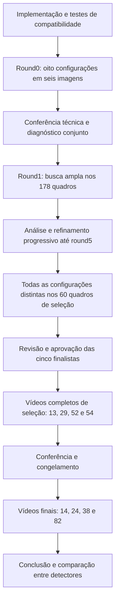

# Watershed: implementação, inspeção e ciclo experimental

## Etapa atual

Blobs teve a avaliação final [conferida e concluída](conclusao_blobs.md).
Watershed está implementado e o round0 foi executado e auditado no batch
`batch__20260921T135941123246Z`: 48 avaliações, caixas compatíveis e arquivos
íntegros. O [diagnóstico](diagnostico_round0_watershed.md) registra as limitações
e fundamenta o [round1](plano_round1_watershed.md), posteriormente
[executado e conferido](analise_round1_watershed.md).
O [round2 foi executado e conferido](analise_round2_watershed.md): 32 configurações,
com variante opcional de Otsu, controles e PDF. O maior F1 foi 0,466361.
O [round3 foi executado e conferido](analise_round3_watershed.md): 24 configurações
nos mesmos 178 quadros, 1.068 controles idênticos e maior F1 de 0,478007.
O [round4 foi executado e conferido](analise_round4_watershed.md): 18 configurações,
1.068 controles idênticos ao round3 e maior F1 de 0,481308.
O [round5 foi executado e conferido](analise_round5_watershed.md): 14 configurações,
2.492 avaliações e 1.068 controles reproduzidos. O maior F1 passou a 0,482362,
com menor cobertura de pequenos que a líder anterior.
As cinco rodadas somam 114 configurações distintas. Os ajustes foram
encerrados e a [seleção foi concluída e conferida](analise_selecao_watershed.md)
nos mesmos 60 quadros reservados: 6.840 avaliações, tabelas e PDF de oito
páginas. A líder s063 teve F1 0,342956. As configurações s063, s064, s061,
s062 e s098 foram aprovadas; os [vídeos de seleção estão preparados](plano_videos_watershed.md)
para execução pelo pesquisador. A avaliação final permanece posterior.
As seções abaixo
preservam o desenho da inspeção. Compatibilidade técnica não demonstra eficácia.

## Representação e técnica

O detector usa a mesma `Caixa`, `Deteccao` e `ResultadoDeteccao` da limiarização:
classe original 0/1/2, caixa em pixels e TXT com centro/largura/altura normalizados.
Cada caixa envolve os pixels de sua região, sem escala ou margem adicional.
Centroide, área segmentada, ocupação, alongamento e intensidade são medidos
nos pixels correspondentes. Não se reutiliza área circular estimada de blobs.
Índices de detecção são locais ao quadro; não representam identidade temporal.

A sequência é:

1. Converter BGR em cinza, aplicar limiar manual/Otsu e abertura/fechamento.
2. Identificar componentes conectados e calcular distância euclidiana ao fundo.
3. Obter sementes conectadas acima de uma fração do máximo **de cada componente**.
   Isso evita que um objeto grande elimine as sementes de objetos pequenos
   separados. Um pequeno objeto unido a um grande ainda pode ficar sem semente
   própria; essa limitação será visível no diagnóstico.
4. Aplicar watershed à distância negativa, restrito à máscara. Usa-se
   `skimage.segmentation.watershed`, com conectividade igual à dos componentes,
   `compactness=0` e `watershed_line=False`. Todos os pixels da máscara são
   distribuídos entre regiões, sem retirar uma linha de pixels na divisão.
5. Aplicar a política de aglomerados, os filtros de área e a classificação
   pela área de cada região final. Produzir suas caixas e medidas.

A distância usa um pixel de fundo externo à imagem para tratar inclusive
objetos nas bordas e máscaras completamente preenchidas. Isso preserva os
pixels observados, sem reconstruir a parte do objeto fora da imagem.

Watershed por marcadores e distância é uma técnica clássica para separar
objetos em contato. A implementação com máscara foi escolhida para conservar
a área segmentada e controlar explicitamente os limites. A definição das
sementes por fração local é uma escolha deste estudo, não uma garantia de
separação correta. Referências: [scikit-image 0.26: watershed](https://scikit-image.org/docs/0.26.x/api/skimage.segmentation.html#skimage.segmentation.watershed)
e [OpenCV: segmentação por marcadores](https://docs.opencv.org/4.13.0/d3/db4/tutorial_py_watershed.html).

## Duas políticas aprovadas para o round0

- **Separar:** emitir cada região produzida pelo watershed, classificada pela
  própria área. Se um aglomerado anotado como uma caixa for dividido em
  indivíduos, a incompatibilidade será penalizada pelo avaliador vigente.
- **Preservar por área:** quando a área do componente original após morfologia
  alcançar o limite de classe 1, reunir suas regiões e emitir somente a caixa
  desse componente. Nos demais componentes, manter as regiões separadas.

Não se emitem pai e filhos simultaneamente. A decisão não consulta anotações.
Área grande pode ser ruído ou fundo unido; preservar por área é uma hipótese
a comparar, não a afirmação de que todo componente grande seja aglomerado.
Caixas retangulares de regiões distintas podem se sobrepor mesmo quando seus
pixels são disjuntos. Não há supressão adicional escondida.

## Round0: oito configurações e seis imagens

Usam-se os mesmos casos de desenvolvimento inspecionados em blobs:
11/0, 12/200, 19/0, 21/0, 23/0 e 36/1300. O plano de origem confirma que
todos pertencem aos 178 quadros aprovados. Nenhum quadro de seleção ou final
foi acrescentado.

| Configuração | Polaridade | Fração da distância máxima local | Política |
|---|---|---:|---|
| w01 | claro | 0,50 | separar |
| w02 | claro | 0,50 | preservar por área |
| w03 | claro | 0,75 | separar |
| w04 | claro | 0,75 | preservar por área |
| w05 | escuro | 0,50 | separar |
| w06 | escuro | 0,50 | preservar por área |
| w07 | escuro | 0,75 | separar |
| w08 | escuro | 0,75 | preservar por área |

Base inicial: Otsu, abertura desligada, fechamento retangular 5×5 uma vez,
conectividade 8, área aceita de 3 a 5.000 pixels, pequeno até 120 e aglomerado
a partir de 900 pixels. Os limites são inclusivos, com normais entre eles.
Esses números são hipóteses iniciais, não faixas biológicas validadas.

A referência é **c01 do round5 de desenvolvimento da limiarização**, congelada
no plano com seu hash. Reutiliza-se uma máscara já estudada para isolar o efeito
da divisão por watershed. O mínimo de área foi reduzido de 48 para 3 para
inspecionar candidatos pequenos, sem eliminar previamente essa frente.
O máximo, limites de classe e fechamento foram mantidos nessa comparação inicial.
Não se usou o desempenho dos vídeos finais para escolher os parâmetros.

Fração 0,50 produz núcleos mais amplos; 0,75 produz núcleos mais restritos,
podendo separar sementes antes unidas. A polaridade escura é um contraste
diagnóstico e pode selecionar fundo. Todos os candidatos, inclusive os
rejeitados por área, permanecem no diagnóstico. As duas políticas são
comparadas aos pares, mudando somente essa decisão.

O módulo aceita limiar manual; o round0 usa Otsu para concentrar a inspeção
nas sementes e na representação dos aglomerados. A exploração de limiares,
morfologia e limites será desenhada após observar essa inspeção.

## Saídas e critérios preservados

Cada execução cria `resultados/frame-to-frame/watershed/round0/batch__<UTC>/`.
Dentro dela, cada configuração tem uma pasta com ID, polaridade, fração,
política, hash completo no plano e prefixo do hash no nome, além do instante.
Todos os artefatos dessa execução ficam dentro do mesmo batch.

- Comparação com anotações, máscara e regiões com sementes brancas, por imagem.
- Tabelas de detecções, anotações, pares e pendentes; TXT no formato da base.
- `diagnostico.json`: componente de origem, sementes, região, área, classe,
  motivo de rejeição ou índice da detecção emitida.
- `mapas.npz`: máscara, distância, componentes, sementes e regiões com IDs
  numéricos; as cores do PNG são apenas visualização, não classes.
- Resumos por quadro/configuração, métricas por grupo, cobertura por classe
  e matriz de erros 0/2, além de **PDF automático de duas páginas**.
- Plano, parâmetros efetivos, origens com hashes, código arquivado e versões
  das dependências. Seed 42 registrada; esta inspeção não usa aleatoriedade.

Pareamento um a um com IoU >= 0,50; indivíduos 0/2 juntos; aglomerados à parte.
Troca 0/2 preserva o acerto de localização e registra erro de classe. Troca
indivíduo/aglomerado continua erro de detecção. Contagens são somadas antes
do F1; somente TP=FP=FN=0 resulta em “sem casos”. Não há ranking no round0.

Repetir a execução preserva as anteriores. Mesmas entradas, configurações,
código e versões permitem reproduzir as detecções; tempos e nomes de execução
variam. Uma seed, sozinha, não garante reprodução entre versões de bibliotecas.

## Validações e sequência

Foram verificados caixas e normalização, centroide/área, círculos em contato,
objetos pequenos e nas bordas, conectividade, máscara vazia/cheia, preservação
da imagem, repetibilidade e políticas sem duplicações. Testes sintéticos do
executor cobrem arquivos, métricas, hashes, PDF, adulteração e falhas recuperáveis.
A conferência real de preparação validou 16 origens sem executar o detector.

Após a execução do pesquisador, conferir completude, integridade, PDF e
imagens. Antes de round1, distinguir falha de máscara, de sementes, de tamanho
de caixa e de classificação. Critérios para avançar: saída tecnicamente
correta, ambas as políticas rastreáveis e limitações identificadas. Um F1
alto nessas seis imagens não é requisito nem demonstração de generalização.

Cada nova rodada será justificada pelos resultados anteriores, com controles
repetidos e plano congelado antes de executar. A composição e o orçamento
do round1 estão no [plano específico](plano_round1_watershed.md); não foram criadas rodadas
futuras sem esses resultados. Configurações finais não serão retocadas
depois de observar os vídeos finais. O histórico de exposição aos dados
permanece registrado, inclusive para watershed.

## Arquivos desta etapa

- Detector: `algoritmos/classicos/watershed.py` e `requirements-watershed.txt`.
- Execução: `scripts/watershed/executar_inspecao.py`, `inspecao/round0.json` e
  [guia](../scripts/watershed/README.md).
- PDF: `analise/relatorio_inspecao_watershed.py`.
- Testes: `scripts/testes/test_watershed.py` e `test_inspecao_watershed.py`.
- Encerramento de blobs: `conclusao_blobs.md` e `estatisticas_final_blobs.json`.
- Guias gerais e `estado_pesquisa.md` atualizados para apontar a etapa vigente.

As bases, configurações históricas e resultados anteriores foram preservados.
