# Protocolo de desenvolvimento por rodadas

Versão 2 — critério de indivíduos aprovado após a primeira seleção em imagens.
Preserva o registro da versão 1, de 19/09/2026, usada nas cinco rodadas e
na avaliação original da seleção. A data UTC de cada execução consta do manifesto.

Este protocolo registra o fluxo atual de desenvolvimento dos detectores em
imagens anotadas. Sua aplicação preparada é a limiarização manual/Otsu. Novos
métodos seguem a mesma organização após definir seus parâmetros e entradas.
Todas as execuções são realizadas pelo pesquisador. A análise dos resultados
e a definição da rodada seguinte são feitas em conjunto.

Para a limiarização, foram previstas **cinco rodadas de desenvolvimento:
round1 a round5**. O `round0` é a inspeção inicial e fica fora dessa contagem.
Esse planejamento não garante melhoria a cada rodada. Novos métodos terão
seu planejamento definido separadamente.

## Fluxograma completo da limiarização

O desenvolvimento, a seleção em imagens e sua reavaliação por indivíduos
estão concluídos, assim como o teste das cinco nos vídeos completos de seleção.
As mesmas cinco configurações foram congeladas e executadas na avaliação final.
A [conclusão da limiarização](conclusao_limiarizacao.md) reúne os resultados
e as limitações. O [plano de blobs](plano_blobs.md) descreve a adaptação
para o próximo detector. O detector e a [inspeção inicial (round0)](../scripts/blobs/README.md)
estão preparados; a execução e revisão dessa inspeção precedem a definição
dos batches de desenvolvimento.

```mermaid
flowchart TD
    INICIO["Definir detector, classes e protocolo<br/>Caixas e classes 0, 1 e 2 da base"]

    subgraph DESENV["1. Desenvolvimento em imagens — concluído"]
        I["Round0: inspeção inicial<br/>Conferir detecções e saídas"]
        P["Planejar o round e salvar sua configuração<br/>Parâmetros, seed, quadros e hashes"]
        D["Executar todas as configurações<br/>Nos mesmos 178 frames de desenvolvimento"]
        A["Comparar com as anotações e calcular F1<br/>Salvar imagens, tabelas e PDF do round"]
        R["Revisar juntos os resultados<br/>Erros, classes e diferenças entre vídeos"]
        Q{"Round5 concluído e revisado?"}
        N["Definir ajustes para o próximo round"]
        C["Encerrar os ajustes e retirar repetições<br/>Fixar as 122 configurações distintas"]
        I --> P --> D --> A --> R --> Q
        Q -->|Não| N --> P
        Q -->|Sim| C
    end

    subgraph SELECAO["2. Seleção em outras imagens — concluída"]
        S["122 configurações fixas já executadas<br/>60 frames dos vídeos 13, 29, 52 e 54"]
        M["Avaliação original preservada<br/>Macro-F1 das três classes"]
        G["Reavaliar caixas salvas com a regra aprovada<br/>Indivíduos 0 e 2 juntos; aglomerados 1 separados"]
        K["Ordenar pelo F1 de indivíduos<br/>Registrar trocas 0/2 e cobertura por classe e vídeo"]
        E["Cinco aprovadas após revisão conjunta<br/>s068, s067, s090, s099 e s101"]
        S --> M --> G --> K --> E
    end

    subgraph VIDEO["3. Teste em vídeos completos de seleção — concluído"]
        V0["Conferir a correspondência<br/>Entre frames do vídeo e anotações"]
        V1["Executar as cinco configurações<br/>Vídeos completos 13, 29, 52 e 54"]
        V2["Avaliar as detecções quadro a quadro<br/>Salvar 20 vídeos comparativos, tabelas e PDF"]
        V3["Revisar os resultados em conjunto<br/>Congelar as escolhas para a avaliação final"]
        V0 --> V1 --> V2 --> V3
    end

    subgraph FINAL["4. Avaliação final em vídeos reservados — concluída"]
        T["Executar as escolhas congeladas<br/>Vídeos completos 14, 24, 38 e 82"]
        U["Comparar com as anotações disponíveis<br/>Manter parâmetros e critérios fixos"]
        F["Consolidar resultados e limitações do algoritmo<br/>Documentar a avaliação final"]
        T --> U --> F
    end

    INICIO --> I
    C --> S
    E --> V0
    V3 --> T
```



O ciclo de ajustes acontece somente no desenvolvimento. A seleção mantém
os parâmetros das 122 candidatas fixos. O teste das cinco em vídeos completos
usa os mesmos vídeos da seleção em imagens, portanto não é uma avaliação
independente desse conjunto. A avaliação final usa os outros quatro vídeos,
após o congelamento das escolhas. O diagrama não cria uma regra adicional
para reduzir as cinco a uma única configuração antes dessa avaliação.

Em todas as etapas, o pesquisador executa os experimentos e os resultados
são revisados em conjunto. Mantêm-se IoU ≥ 0,50, pareamento um para um e
soma de TP, FP e FN antes de calcular F1. Na versão 1, o acerto exigia a
mesma classe e a comparação usava macro-F1, com F1 normal somente no empate.
Na regra atual, a correspondência exige o mesmo grupo: indivíduos (0/2)
ou aglomerados (1). A seleção prioriza F1 de indivíduos e mantém os erros
de classificação separados. Valores sem casos permanecem indefinidos;
empates do novo ranking exigem discussão conjunta, sem desempate automático.

Nos vídeos completos, a detecção percorrerá os quadros e a avaliação usará
os quadros com anotações disponíveis e correspondência conferida. Quadros
sem anotação não são considerados automaticamente sem objetos. Esta fase
continua sendo detecção quadro a quadro; rastreamento e predição de movimento
serão tratados posteriormente.

Na implementação atual em imagens, detecção, avaliação e gravação acontecem
por quadro/configuração; a consolidação reúne as contagens ao final de cada
configuração. Após a conclusão do batch, o PDF reúne os resultados salvos.
O executor de seleção em vídeos foi executado e seus resultados conferidos.
A etapa final também foi executada e seus registros conferidos. Os testes
de código não foram executados nesta revisão documental.

## Preparação e comparação justa

| Rodada | Finalidade | Situação do plano |
|---|---|---|
| `round0` | Inspeção inicial e identificação de problemas; fora das cinco rodadas | Primeiro teste e avaliação realizados pelo pesquisador |
| `round1` | Explorar configurações variadas de limiarização | 48 configurações executadas e analisadas; sorteio com seed 42 |
| `round2` | Testar ajustes de área, classificação, morfologia e limiar manual | 32 configurações executadas; lista determinística baseada no round1; revisão dos resultados |
| `round3` | Refinar as hipóteses a partir dos resultados do round2 | 24 configurações executadas e analisadas; lista determinística |
| `round4` | Refinar limites de classificação e limiares manuais nas segmentações comparadas | 18 configurações executadas e analisadas; lista determinística |
| `round5` | Fazer a última rodada planejada de desenvolvimento | 14 configurações executadas e analisadas; desenvolvimento encerrado; não é a avaliação final |
| `selecao` | Comparar as candidatas fixadas nos frames reservados | 122 configurações distintas × 60 quadros executados e reavaliados por grupos; cinco aprovadas |
| Vídeos de seleção | Avaliar as cinco nos quatro MP4 completos | 5.850 quadros por configuração executados; resultados e PDF conferidos |
| Avaliação final | Medir as cinco escolhas congeladas nos quatro vídeos finais | 5.910 quadros por configuração executados; 29.550 avaliações, 20 MP4 e PDF concluídos; registros conferidos |

O mesmo `scripts/limiarizacao/executar_rodada.py` executa todas as rodadas.
`--rodada round1` identifica o plano `scripts/limiarizacao/rodadas/round1.json`;
`--rodada round2`, `--rodada round3`, `--rodada round4` e `--rodada round5`
identificam os planos seguintes. `--plano` permite informar uma cópia salva
em outro local. Os cinco planos foram executados. Sem argumentos, o executor
continua em `round1`. A
criação de uma pasta de resultados não prepara automaticamente uma rodada.

Para repetir a quinta rodada, na raiz do projeto:

```powershell
& "C:\Python313\python.exe" ".\scripts\limiarizacao\executar_rodada.py" --rodada round5
```

O round2 mantém os 178 quadros do round1: 32 configurações totalizam 5.696
avaliações de imagem. A [revisão do round1](rodadas/round1_revisao.md) documenta
o diagnóstico e os motivos das novas configurações. Sua lista é determinística,
sem novo sorteio; a seed 42 permanece apenas como registro. O script
`preparar_rodada.py` continua limitado à exploração inicial e não reconstrói
round2, round3, round4 ou round5. Para repeti-los, use os planos salvos.

A [revisão do round2](rodadas/round2_revisao.md) registra os resultados dessa
execução e orientou o plano do [round3](../scripts/limiarizacao/rodadas/round3.json):
24 configurações executadas nos mesmos 178 quadros, totalizando 4.272 avaliações,
com PDF concluído. A [revisão do round3](rodadas/round3_revisao.md) orientou o
plano de [18 configurações do round4](../scripts/limiarizacao/rodadas/round4.json):
3.204 avaliações executadas nos mesmos quadros, com PDF concluído. Quatro
configurações são controles; as demais refinam limites de classificação e
limiares manuais.

A [revisão do round4](rodadas/round4_revisao.md) e a
[reavaliação de 25 combinações salvas](rodadas/round4_reavaliacao_areas.json)
orientaram o plano de [14 configurações do round5](../scripts/limiarizacao/rodadas/round5.json):
2.492 avaliações concluídas nos mesmos quadros, com PDF. São quatro controles,
duas variações de classificação Otsu e
oito variações manuais de limiar ou forma do fechamento. Os planos anteriores
permanecem preservados. A [revisão do round5](rodadas/round5_revisao.md)
registra a melhoria pequena e o encerramento das cinco rodadas. Todas as
122 configurações distintas foram fixadas para a seleção, sem escolher
finalistas com os dados de desenvolvimento.

Na primeira rodada são 24 configurações manuais e 24 Otsu, com equilíbrio
entre polaridades clara e escura. A configuração `c01` repete os parâmetros
do teste inicial como referência. Esses parâmetros são hipóteses de teste;
a preparação do plano não comprova desempenho.

O conjunto de desenvolvimento permanece fixo: 178 quadros dos vídeos 11, 12,
15, 19, 21, 22, 23, 30, 35, 36, 47 e 60. A amostragem usa os quadros 0, 100,
..., 1400, com as exclusões acordadas de 900 e 1100 do vídeo 23 por ausência
de anotação. Essas ausências não são consideradas imagens sem objetos.

O plano contém todas as configurações, a ordem dos quadros e os hashes das
entradas. Arquivo ausente, alterado ou inválido interrompe o batch; não há
exclusão automática. Todas as configurações comparáveis usam as mesmas
imagens, anotações e regras de avaliação. O detector recebe somente a imagem
e os parâmetros; as anotações são usadas na avaliação e na comparação visual.

## Avaliação histórica das rodadas — versão 1

O acerto exige a mesma classe da anotação e IoU maior ou igual a 0,50, com
correspondência um para um. Entre associações válidas, maximiza-se primeiro
o número de pares e depois a soma das IoUs. Detecções sem par são falsos
positivos (FP); anotações sem par são falsos negativos (FN); pares válidos
são verdadeiros positivos (TP). As classes continuam sendo 0 normal,
1 aglomerado e 2 pequeno.

Para cada configuração, somam-se TP, FP e FN por classe em todos os quadros
antes de calcular as métricas. O macro-F1 é a média dos três F1 de classe
assim obtidos. Não se calcula a média dos F1 dos quadros ou dos vídeos.

Quando uma classe não tem anotações nem previsões, seu F1 aparece como
`sem_casos` (`null` no JSON). Com FP ou FN e nenhum TP, F1 vale zero.
O macro-F1 fica indefinido se uma das três classes estiver sem casos.

A localização também é avaliada separadamente, por um novo pareamento que
ignora a classe. Essa análise auxilia o diagnóstico e não altera a métrica
principal. Resultados por vídeo, imagens e tabelas de pares/pendências ajudam
a verificar falsos positivos, perdas, confusões entre classes e concentração
do desempenho em poucos vídeos.

## Revisão e definição das rodadas — versão 1

As configurações são comparadas pelo macro-F1. Somente em empate exato,
antes do arredondamento, a classe 0 recebe prioridade pelo seu F1. O tempo
registrado atualmente é diagnóstico; seu uso como desempate ainda depende
da definição da medição apropriada. Pequenas diferenças de F1 não comprovam,
por si, superioridade estatística.

O executor entrega os resumos na ordem do plano, sem selecionar vencedores.
O PDF ordena as configurações para visualização, sem escolher finalistas.
Suas estatísticas descrevem a distribuição entre configurações; não são
intervalos de confiança nem testes de significância. Elas não substituem
o cálculo de cada F1 a partir das contagens agregadas.
Na revisão conjunta, examinamos as métricas e os erros antes de definir
novas combinações. A rodada seguinte pode refinar faixas promissoras e
explorar alternativas; sua lista completa deve ser registrada antes da
execução. Os planos e resultados anteriores são preservados para comparação.

Ao concluir a revisão do round5 da limiarização, fixamos as candidatas a levar
à seleção. Isso encerra as cinco rodadas previstas de desenvolvimento, sem
comprovar superioridade ou substituir a avaliação nos conjuntos reservados.
Os vídeos de seleção e avaliação final não orientam o refinamento dessas rodadas.

## Repetição e armazenamento

Uma **nova rodada** testa um novo plano após revisão conjunta. Uma
**repetição** executa o plano já salvo, sem novo sorteio: continua no mesmo
`round`, com nova identificação de execução e sem sobrescrever resultados.

```text
resultados/frame-to-frame/<algoritmo>/round<N>/
├── batch__<execucao>/
│   ├── rodada.json
│   ├── execucao.json
│   ├── codigo.zip
│   ├── resumo_configuracoes.csv
│   ├── resumo_por_video.csv
│   └── relatorios/<data-hora-UTC>/
│       ├── relatorio.pdf
│       ├── relatorio.json
│       └── execucao_origem.json
└── <configuracao>__<execucao>/
    ├── configuracao.json
    ├── execucao.json
    ├── avaliacao.json
    ├── tabelas de deteccoes, anotacoes, metricas, pares e pendentes
    ├── predicoes/
    └── midia/
```

A seed reproduz um sorteio com o mesmo gerador e ambiente, quando houver
sorteio; ela não gera as listas determinísticas de round2, round3, round4 e round5.
Para repetir a rodada, a referência principal é o plano salvo. A reprodução exige também
preservar dados, código e versões das bibliotecas; horários e tempos de
processamento podem variar. Falhas preservam saídas parciais, mas não
constituem uma rodada concluída. O executor atual inicia uma execução nova
ao repetir o comando, sem retomar ou misturar arquivos parciais.

O PDF pode ser gerado novamente a partir de um batch concluído, sem repetir
as detecções. Cada geração recebe uma pasta própria. Seu estado é separado
da conclusão das métricas: uma falha no relatório preserva os resultados
do batch e permite gerar somente o PDF posteriormente.

## Etapas posteriores

Depois das cinco rodadas de desenvolvimento da limiarização, o protocolo
acordado prevê comparar candidatas nas imagens dos vídeos de seleção
(13, 29, 52 e 54), escolher cinco e avaliá-las
nos vídeos completos desse conjunto. Após congelar as escolhas, a avaliação
final usará os vídeos completos 14, 24, 38 e 82 e as anotações disponíveis.
A reserva dos conjuntos nesta versão não elimina o histórico de exposição
anterior aos dados.

A composição da seleção foi aprovada após o round5: **todas as 122
configurações distintas**, preservando seus parâmetros, nos **60 quadros**
0, 100, ..., 1400 dos quatro vídeos reservados. Os pares estão completos;
não há exclusões. A deduplicação considera equivalentes as diferenças de
forma/tamanho em operações morfológicas desativadas, como no executor atual.
Os 136 registros de execução das rodadas permanecem preservados.

O [plano de seleção](../scripts/limiarizacao/selecao/plano.json) registra
as origens das candidatas e os hashes de todas as entradas. IDs `s001` a
`s122` seguem a primeira ocorrência nas rodadas. A composição foi fixada
antes de qualquer resultado de detecção nesses 60 quadros nesta etapa.
Não serão criados novos parâmetros com base na seleção.

O pesquisador executou `scripts/limiarizacao/executar_selecao.py`:
7.320 avaliações, com saídas em `resultados/frame-to-frame/limiarizacao/selecao/`
e PDF automático. Essa avaliação original usou as regras de pareamento,
agregação, macro-F1 e desempate da classe 0 do desenvolvimento. Na versão 1,
empates remanescentes e valores indefinidos exigiam revisão conjunta; o ID
no relatório serve somente à ordem visual estável. Não há promoção automática.

A seleção original foi concluída em `batch__20260920T012713968145Z`, com
7.320 avaliações e PDF. A reavaliação e a escolha das cinco também foram
concluídas. Antes de
avaliar os vídeos, será conferida a correspondência entre frames decodificados
e anotações disponíveis; ausência de anotação não equivale a ausência de objetos.

## Reavaliação por indivíduos — versão 2, concluída

Após observar a primeira seleção, foi acordado priorizar a localização de
indivíduos e separar o erro entre normal e pequeno. Essa é uma alteração
posterior à observação dos resultados: não deve ser apresentada como critério
fixado antes dos experimentos. Os resultados e o ranking históricos continuam
disponíveis, permitindo discutir o efeito da mudança. Não há novos parâmetros,
novas candidatas ou novas imagens nesta reavaliação.

O novo pareamento usa as caixas e os rótulos salvos, com IoU ≥ 0,50:

- Classes 0 e 2 pertencem ao grupo de indivíduos. Um par 0/2 ou 2/0 conta
  como TP de detecção e como erro de classificação registrado à parte.
- A classe 1 pertence ao grupo de aglomerados. Uma troca entre indivíduo e
  aglomerado não forma par: conta FN no grupo anotado e FP no previsto.
- Cada caixa participa de no máximo um par. Maximiza-se primeiro o número
  de pares válidos e depois a soma das IoUs, sem preferir rótulos iguais.
- O pareamento é refeito; não se reaproveitam pares da avaliação anterior,
  pois a mudança das correspondências permitidas pode alterar as associações.

O critério principal é **F1 de indivíduos**, calculado após somar as contagens
dos 60 quadros. Não é macro-F1 das classes 0 e 2, nem uma média por vídeo.
Classes e vídeos com mais indivíduos anotados influenciam mais essa medida.
Por isso, a revisão conjunta observará também precisão, recall, cobertura de
normais e pequenos separadamente, erros 0/2, aglomerados e resultados por vídeo.
Não foi adotado peso numérico, limite mínimo ou desempate secundário adicional.

O ranking compara a fração exata `2TP/(2TP+FP+FN)`. Configurações empatadas
recebem o mesmo posto; o ID organiza apenas a apresentação. Empates que
atravessem as posições cinco e seis são destacados para discussão. Valores
indefinidos aparecem como `sem_casos` e não recebem posto. Nenhum script
escolhe ou promove cinco automaticamente.

A classificação é descrita pela matriz 0/2 dos indivíduos pareados e pela
acurácia condicional: rótulos corretos divididos pelos pares de indivíduos.
Essa taxa exclui objetos perdidos e falsas detecções, e deve ser lida junto
com o F1 e a cobertura. Um bom valor condicional isolado não implica boa
detecção. As classes originais continuam preservadas nas tabelas e na base.

O pesquisador executou `scripts/limiarizacao/reavaliar_selecao.py`.
As saídas estão dentro do batch original em
`reavaliacoes_individuos/20260920T021112218814Z/`, com cópia do código, hashes,
contagens por quadro/vídeo/configuração, ranking e PDF. A execução usou somente
as tabelas salvas. A conferência confirmou as 7.320 avaliações, as origens
e a coerência das contagens. Após a revisão, foram aprovadas as cinco abaixo.

## Vídeos de seleção — execução concluída e revisada

| Configuração | F1 de indivíduos nos 60 quadros | TP | FP | FN |
|---|---:|---:|---:|---:|
| s068 | 0,273511 | 365 | 1044 | 895 |
| s067 | 0,257778 | 348 | 1092 | 912 |
| s090 | 0,173576 | 224 | 1097 | 1036 |
| s099 | 0,172026 | 222 | 1099 | 1038 |
| s101 | 0,172026 | 222 | 1099 | 1038 |

Os valores acima são arredondados apenas para apresentação. `s099` e `s101`
ocupam as posições 4 e 5 em empate; a sexta tem F1 inferior. Ambas permanecem,
pois diferem no limite de classificação pequeno/normal. Não houve desempate
novo ou alteração dos parâmetros. Os resultados justificam medir as limitações
em mais quadros, sem caracterizar bom desempenho: as duas manuais não detectaram
indivíduos nos quadros amostrados dos vídeos 29 e 52, e a cobertura de pequenos
foi baixa nas cinco configurações.

O [plano de vídeos](../scripts/limiarizacao/videos/plano_selecao.json) fixa
as cinco configurações, os MP4 completos e todos os arquivos de anotação.
Vídeos 13, 29 e 54 contêm 1.470 quadros a 49 FPS; o vídeo 52 contém 1.440
a 48 FPS. Todos têm 640 × 480 pixels e 30 segundos, conforme os metadados
dos MP4. Existem arquivos de anotação para todos os 5.850 índices, base zero.
Foram 29.250 avaliações e 20 MP4 comparativos, sem amostragem ou novos ajustes.

Antes de detectar, o executor confere hashes e conteúdo das anotações. Para
cada vídeo, compara cinco JPEGs de referência (quadros 0, 100, 700, 1400 e
último) contra todos os quadros MP4, pelo erro médio absoluto em cinza.
Cada índice esperado deve ser o mínimo único; divergência ou empate interrompe
a execução antes de qualquer detector. As imagens comparativas e diferenças
ficam salvas em `conferencia/`. Isso verifica correspondência temporal nas
referências, sem comprovar igualdade de pixels entre formatos ou alinhamento
individual de todos os JPEGs. A conferência real passou nas 20 referências
do batch de seleção, com o índice esperado como mínimo único em todas.

Essa primeira decodificação registra hashes BGR de todos os quadros, que
precisam coincidir antes de cada detecção nas cinco configurações. O tempo
relativo é o índice dividido pelo FPS, coerente com a taxa constante registrada
nos arquivos. Índices de detecção são locais, sem rastreamento ou velocidade.
Os vídeos gerados preservam a velocidade original e mostram anotações à esquerda,
detecções à direita, classes, quadro, tempo e contagens de indivíduos. Após
gravar, o executor reabre cada MP4 para conferir dimensões, FPS e completude.

Tabelas, configurações, cópia do código, versões, hashes e PDF ficam em uma
nova pasta `resultados/videos/limiarizacao/selecao/batch__<execucao>/`.
A seed 42 é mantida como registro; esta etapa não sorteia parâmetros ou quadros.
Repetições usam o plano congelado e criam novas pastas. Os originais e resultados
anteriores permanecem preservados. Os vídeos já participaram da seleção em
imagens; diferenças JPEG/MP4 e mais quadros podem alterar as métricas. Esta
etapa não é uma avaliação independente da seleção.

O pesquisador concluiu `batch__20260920T023832151694Z`. A conferência dos
registros verificou 5.879 hashes de origem, 98 de saída, 20 MP4, cinco execuções
completas e a consistência entre caixas, pares, pendências e resumos. O executor
registrou a decodificação completa dos MP4 gerados; a auditoria posterior
conferiu os hashes, sem decodificá-los novamente. O PDF de três páginas foi
inspecionado visualmente.

| Configuração | F1 de indivíduos nos vídeos completos |
|---|---:|
| s068 | 0,257230 |
| s067 | 0,246072 |
| s090 | 0,163433 |
| s099 | 0,162946 |
| s101 | 0,162946 |

A ordem permaneceu igual à seleção em imagens, mas os resultados continuam
limitados. Nos vídeos 29 e 52, as duas manuais geraram uma caixa cobrindo a
imagem inteira como aglomerado em todos os quadros e não tiveram TP de
indivíduos. Otsu teve melhor desempenho nesses vídeos, mas pior nos outros
dois. A cobertura de pequenos ficou abaixo de 5% nas cinco configurações;
todos os pequenos localizados nos pares válidos foram classificados como normais.
Esses resultados foram discutidos antes de congelar as escolhas.

## Avaliação final — concluída e consolidada

Foi aprovado manter **s068, s067, s090, s099 e s101**, sem alterar parâmetros,
nos vídeos completos **14, 24, 38 e 82**. O
[plano final](../scripts/limiarizacao/videos/plano_final.json) registra a
decisão, os hashes das fontes e a proveniência da seleção concluída. Ele
preserva os mesmos critérios: F1 de indivíduos 0/2, erros de classificação
separados, aglomerados à parte e IoU ≥ 0,50. Não há novos pesos ou desempates.

Vídeos 14, 24 e 38 têm 1.470 quadros a 49 FPS; o 82 tem 1.500 a 50 FPS.
Todos têm 640 × 480 pixels e 30 segundos. As 5.910 anotações existem e seu
formato foi conferido, sem lacunas. Foram **29.550 avaliações e 20 vídeos
comparativos**. A verificação temporal usou as mesmas cinco posições de
referência por vídeo, com hashes dos pixels antes de cada detecção.

O mesmo script executa a etapa final com `--etapa final`. Sem essa opção,
o padrão permanece seleção. Planos, tipos de manifesto, vídeos e pastas são
validados por etapa. Os resultados finais ficam em
`resultados/videos/limiarizacao/final/batch__<execucao>/`, com a mesma estrutura
de mídia, tabelas, código arquivado, hashes e PDF.

As cinco escolhas e os critérios foram congelados antes da execução final
nesta versão. Os resultados finais são apresentados para as cinco, sem
iniciar outra busca de parâmetros nesse conjunto. Não se interpretará uma
escolha posterior pelo maior F1 final como decisão anterior ao teste. A exposição
histórica aos dados permanece documentada; a reserva atual não torna os vídeos
inéditos. A limiarização foi consolidada com suas limitações antes de
implementar o próximo detector em etapa própria.

O batch final `batch__20260920T030805588232Z` está concluído. A conferência
verificou cobertura sem lacunas, contagens por quadro/vídeo/configuração,
hashes das fontes e saídas e código arquivado. Os registros indicam a
conferência de decodificação dos 20 MP4 feita pelo executor; não houve nova
decodificação nem renderização do PDF nesta revisão. Os testes de código
também não foram executados nesta revisão.

`s099` e `s101` empataram no maior F1 final de indivíduos, 0,566796, mas não
localizaram as 2.936 ocorrências de pequenos. As manuais, líderes na seleção,
ficaram próximas de 0,02 no final. A
[análise consolidada](conclusao_limiarizacao.md) detalha essa variação,
os erros de classificação e as limitações do estudo. O ranking é descritivo;
não redefine retroativamente a escolha feita antes da avaliação final.

Comandos e detalhes das saídas: [scripts/README.md](../scripts/README.md).
Regras das métricas: [analise/README.md](README.md).
Planos preparados: [round1.json](../scripts/limiarizacao/rodadas/round1.json),
[round2.json](../scripts/limiarizacao/rodadas/round2.json),
[round3.json](../scripts/limiarizacao/rodadas/round3.json),
[round4.json](../scripts/limiarizacao/rodadas/round4.json) e
[round5.json](../scripts/limiarizacao/rodadas/round5.json).
