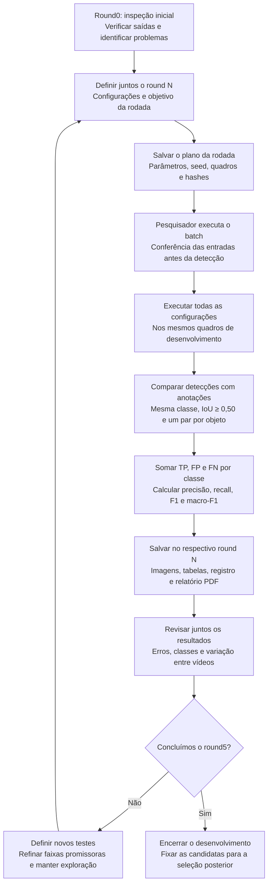

# Protocolo de desenvolvimento por rodadas

Versão 1 — 19/09/2026.

Este protocolo registra o fluxo atual de desenvolvimento dos detectores em
imagens anotadas. Sua aplicação preparada é a limiarização manual/Otsu. Novos
métodos seguem a mesma organização após definir seus parâmetros e entradas.
Todas as execuções são realizadas pelo pesquisador. A análise dos resultados
e a definição da rodada seguinte são feitas em conjunto.

Para a limiarização, foram previstas **cinco rodadas de desenvolvimento:
round1 a round5**. O `round0` é a inspeção inicial e fica fora dessa contagem.
Esse planejamento não garante melhoria a cada rodada. Novos métodos terão
seu planejamento definido separadamente.

## Fluxograma



O fluxo resume uma rodada completa. Na implementação, a detecção, a avaliação
e a gravação acontecem por quadro/configuração; a consolidação reúne as
contagens ao final de cada configuração. Os resumos são atualizados conforme
as configurações terminam. Após a conclusão do batch, o relatório PDF reúne
os resultados salvos em gráficos e estatísticas descritivas.

## Preparação e comparação justa

| Rodada | Finalidade | Situação do plano |
|---|---|---|
| `round0` | Inspeção inicial e identificação de problemas; fora das cinco rodadas | Primeiro teste e avaliação realizados pelo pesquisador |
| `round1` | Explorar configurações variadas de limiarização | 48 configurações executadas e analisadas; sorteio com seed 42 |
| `round2` | Testar ajustes de área, classificação, morfologia e limiar manual | 32 configurações executadas; lista determinística baseada no round1; revisão dos resultados |
| `round3` | Refinar as hipóteses a partir dos resultados do round2 | 24 configurações executadas e analisadas; lista determinística |
| `round4` | Refinar limites de classificação e limiares manuais nas segmentações comparadas | 18 configurações executadas e analisadas; lista determinística |
| `round5` | Fazer a última rodada planejada de desenvolvimento, antes da revisão conjunta e do congelamento das candidatas | 14 configurações salvas; ainda não executadas; execução pelo pesquisador; não é a avaliação final |

O mesmo `scripts/limiarizacao/executar_rodada.py` executa todas as rodadas.
`--rodada round1` identifica o plano `scripts/limiarizacao/rodadas/round1.json`;
`--rodada round2`, `--rodada round3`, `--rodada round4` e `--rodada round5`
identificam os planos seguintes. `--plano` permite informar uma cópia salva
em outro local. Os cinco planos estão preparados; o round5 ainda não foi
executado. Sem argumentos, o executor continua em `round1`. A
criação de uma pasta de resultados não prepara automaticamente uma rodada.

Para o pesquisador executar a quinta rodada, na raiz do projeto:

```powershell
& "C:\Python313\python.exe" ".\scripts\limiarizacao\executar_rodada.py" --rodada round5
```

O round2 mantém os 178 quadros do round1: 32 configurações totalizam 5.696
avaliações de imagem. A [revisão do round1](rodadas/round1_revisao.md) documenta
o diagnóstico e os motivos das novas configurações. Sua lista é determinística,
sem novo sorteio; a seed 42 permanece apenas como registro. O script
`preparar_rodada.py` continua limitado à exploração inicial e não reconstrói
round2, round3, round4 ou round5. Para repeti-los, use os planos salvos.

A [revisão do round2](rodadas/round2_revisao.md) registra os resultados dessa
execução e orientou o plano do [round3](../scripts/limiarizacao/rodadas/round3.json):
24 configurações executadas nos mesmos 178 quadros, totalizando 4.272 avaliações,
com PDF concluído. A [revisão do round3](rodadas/round3_revisao.md) orientou o
plano de [18 configurações do round4](../scripts/limiarizacao/rodadas/round4.json):
3.204 avaliações executadas nos mesmos quadros, com PDF concluído. Quatro
configurações são controles; as demais refinam limites de classificação e
limiares manuais.

A [revisão do round4](rodadas/round4_revisao.md) e a
[reavaliação de 25 combinações salvas](rodadas/round4_reavaliacao_areas.json)
orientaram o plano de [14 configurações do round5](../scripts/limiarizacao/rodadas/round5.json):
2.492 avaliações nos mesmos quadros, ainda não executadas, com PDF automático
ao concluir. São quatro controles, duas variações de classificação Otsu e
oito variações manuais de limiar ou forma do fechamento. Os planos anteriores
permanecem preservados. Depois da execução, a revisão conjunta precederá o
congelamento das candidatas e a seleção posterior; não há garantia de ganho
nem escolha de finalistas nesta preparação.

Na primeira rodada são 24 configurações manuais e 24 Otsu, com equilíbrio
entre polaridades clara e escura. A configuração `c01` repete os parâmetros
do teste inicial como referência. Esses parâmetros são hipóteses de teste;
a preparação do plano não comprova desempenho.

O conjunto de desenvolvimento permanece fixo: 178 quadros dos vídeos 11, 12,
15, 19, 21, 22, 23, 30, 35, 36, 47 e 60. A amostragem usa os quadros 0, 100,
..., 1400, com as exclusões acordadas de 900 e 1100 do vídeo 23 por ausência
de anotação. Essas ausências não são consideradas imagens sem objetos.

O plano contém todas as configurações, a ordem dos quadros e os hashes das
entradas. Arquivo ausente, alterado ou inválido interrompe o batch; não há
exclusão automática. Todas as configurações comparáveis usam as mesmas
imagens, anotações e regras de avaliação. O detector recebe somente a imagem
e os parâmetros; as anotações são usadas na avaliação e na comparação visual.

## Avaliação de uma rodada

O acerto exige a mesma classe da anotação e IoU maior ou igual a 0,50, com
correspondência um para um. Entre associações válidas, maximiza-se primeiro
o número de pares e depois a soma das IoUs. Detecções sem par são falsos
positivos (FP); anotações sem par são falsos negativos (FN); pares válidos
são verdadeiros positivos (TP). As classes continuam sendo 0 normal,
1 aglomerado e 2 pequeno.

Para cada configuração, somam-se TP, FP e FN por classe em todos os quadros
antes de calcular as métricas. O macro-F1 é a média dos três F1 de classe
assim obtidos. Não se calcula a média dos F1 dos quadros ou dos vídeos.

Quando uma classe não tem anotações nem previsões, seu F1 aparece como
`sem_casos` (`null` no JSON). Com FP ou FN e nenhum TP, F1 vale zero.
O macro-F1 fica indefinido se uma das três classes estiver sem casos.

A localização também é avaliada separadamente, por um novo pareamento que
ignora a classe. Essa análise auxilia o diagnóstico e não altera a métrica
principal. Resultados por vídeo, imagens e tabelas de pares/pendências ajudam
a verificar falsos positivos, perdas, confusões entre classes e concentração
do desempenho em poucos vídeos.

## Revisão e definição da próxima rodada

As configurações são comparadas pelo macro-F1. Somente em empate exato,
antes do arredondamento, a classe 0 recebe prioridade pelo seu F1. O tempo
registrado atualmente é diagnóstico; seu uso como desempate ainda depende
da definição da medição apropriada. Pequenas diferenças de F1 não comprovam,
por si, superioridade estatística.

O executor entrega os resumos na ordem do plano, sem selecionar vencedores.
O PDF ordena as configurações para visualização, sem escolher finalistas.
Suas estatísticas descrevem a distribuição entre configurações; não são
intervalos de confiança nem testes de significância. Elas não substituem
o cálculo de cada F1 a partir das contagens agregadas.
Na revisão conjunta, examinamos as métricas e os erros antes de definir
novas combinações. A rodada seguinte pode refinar faixas promissoras e
explorar alternativas; sua lista completa deve ser registrada antes da
execução. Os planos e resultados anteriores são preservados para comparação.

Ao concluir a revisão do round5 da limiarização, fixamos as candidatas a levar
à seleção. Isso encerra as cinco rodadas previstas de desenvolvimento, sem
comprovar superioridade ou substituir a avaliação nos conjuntos reservados.
Os vídeos de seleção e avaliação final não orientam o refinamento dessas rodadas.

## Repetição e armazenamento

Uma **nova rodada** testa um novo plano após revisão conjunta. Uma
**repetição** executa o plano já salvo, sem novo sorteio: continua no mesmo
`round`, com nova identificação de execução e sem sobrescrever resultados.

```text
resultados/frame-to-frame/<algoritmo>/round<N>/
├── batch__<execucao>/
│   ├── rodada.json
│   ├── execucao.json
│   ├── codigo.zip
│   ├── resumo_configuracoes.csv
│   ├── resumo_por_video.csv
│   └── relatorios/<data-hora-UTC>/
│       ├── relatorio.pdf
│       ├── relatorio.json
│       └── execucao_origem.json
└── <configuracao>__<execucao>/
    ├── configuracao.json
    ├── execucao.json
    ├── avaliacao.json
    ├── tabelas de deteccoes, anotacoes, metricas, pares e pendentes
    ├── predicoes/
    └── midia/
```

A seed reproduz um sorteio com o mesmo gerador e ambiente, quando houver
sorteio; ela não gera as listas determinísticas de round2, round3, round4 e round5.
Para repetir a rodada, a referência principal é o plano salvo. A reprodução exige também
preservar dados, código e versões das bibliotecas; horários e tempos de
processamento podem variar. Falhas preservam saídas parciais, mas não
constituem uma rodada concluída. O executor atual inicia uma execução nova
ao repetir o comando, sem retomar ou misturar arquivos parciais.

O PDF pode ser gerado novamente a partir de um batch concluído, sem repetir
as detecções. Cada geração recebe uma pasta própria. Seu estado é separado
da conclusão das métricas: uma falha no relatório preserva os resultados
do batch e permite gerar somente o PDF posteriormente.

## Etapas posteriores

Depois das cinco rodadas de desenvolvimento da limiarização, o protocolo
acordado prevê comparar candidatas
nas imagens dos vídeos de seleção (13, 29, 52 e 54), escolher cinco e avaliá-las
nos vídeos completos desse conjunto. Após congelar as escolhas, a avaliação
final usará os vídeos completos 14, 24, 38 e 82 e as anotações disponíveis.
Essas etapas não são executadas pelo batch atual. A reserva dos conjuntos
nesta versão não elimina o histórico de exposição anterior aos dados.

Comandos e detalhes das saídas: [scripts/README.md](../scripts/README.md).
Regras das métricas: [analise/README.md](README.md).
Planos preparados: [round1.json](../scripts/limiarizacao/rodadas/round1.json),
[round2.json](../scripts/limiarizacao/rodadas/round2.json),
[round3.json](../scripts/limiarizacao/rodadas/round3.json),
[round4.json](../scripts/limiarizacao/rodadas/round4.json) e
[round5.json](../scripts/limiarizacao/rodadas/round5.json).
